# 日本語訳: Investigation on road traffic safety in rural areas

- 原文ファイル: Investigation on road traffic safety in rural areas.pdf
- ページ数: 19
- 作成日時: 2026-06-08 04:54:58
- 注記: PDFから抽出した本文の機械翻訳です。図表、数式、脚注、参考文献の体裁は元PDFと完全には一致しません。

## ページ 1

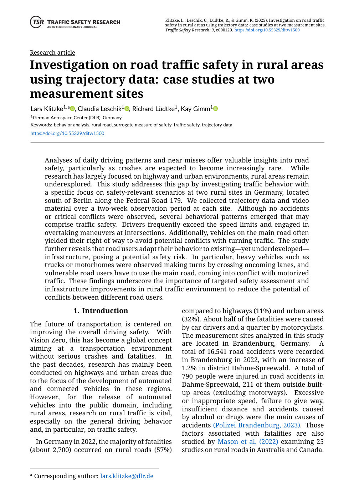

Klitzke, L.、Leschik, C.、Lüdtke, R.、& Gimm, K. (2025)、軌跡データを使用した農村部の道路交通安全の調査: 2 つの測定サイトでのケーススタディ。交通安全研究、9、e000120。 https://doi.org/10.55329/ditw1500 研究論文 軌跡データを用いた農村地域における交通安全の調査: 2 つの測定サイトでのケーススタディ Lars Klitzke1,a 、Claudia Leschik 1 、Richard Lüdtke1、Kay Gimm 1 1 ドイツ航空宇宙センター (DLR)、ドイツ キーワード: 行動分析、田舎の道路、安全性の代替尺度、交通安全、軌跡データ https://doi.org/10.55329/ditw1500 毎日の運転パターンとニアミスの分析は、特に衝突事故がますます稀になると予想される中で、交通安全に関する貴重な洞察を提供します。研究は主に高速道路や都市環境に焦点を当ててきましたが、農村地域は依然として調査が進んでいません。この研究では、ベルリンの南、連邦道 179 号線沿いに位置するドイツの 2 つの田舎の現場で、安全関連のシナリオに特に焦点を当てて交通行動を調査することで、このギャップに対処しています。私たちは、各現場で 2 週間の観察期間にわたって軌跡データとビデオ素材を収集しました。事故や重大な紛争は観察されませんでしたが、交通安全を構成する可能性のあるいくつかの行動パターンが明らかになりました。ドライバーは頻繁に制限速度を超え、交差点で追い越しを行っています。さらに、幹線道路を走行する車両は、右折車との潜在的な衝突を避けるために優先権を譲ることがよくありました。この調査ではさらに、道路利用者が既存の（まだ未開発の）インフラに行動を適応させており、潜在的な安全上のリスクを引き起こしていることが明らかになりました。特に、トラックやキャンピングカーなどの大型車両が対向車線を横切って曲がる様子が観察され、交通弱者は本道を使用しなければならず、自動車交通と衝突することになる。これらの調査結果は、異なる道路利用者間の衝突の可能性を減らすために、地方の交通環境における的を絞った安全性評価とインフラ改善の重要性を強調しています。 1. はじめに 交通の将来は、全体的な運転の安全性を向上させることに重点が置かれています。 Vision Zeroでは、重大な衝突事故や死亡事故のない交通環境を目指す世界的なコンセプトとなっています。過去数十年間、これらの地域では自動運転車やコネクテッドビークルの開発に焦点が当てられていたため、研究は主に高速道路や都市部で行われてきました。しかし、自動運転車を農村部を含む公共領域に公開するには、農村部の交通、特に一般的な運転行動、特に交通安全に関する研究が不可欠です。 2022年のドイツでは、死亡事故（約2,700人）の大部分は高速道路（11％）や都市部（32％）と比較して、田舎道（57％）で発生しました。死亡事故の約半数は自動車運転者によるもので、4分の1はオートバイによるものでした。この研究で分析された測定サイトは、ドイツのブランデンブルクにあります。ブランデンブルク州では 2022 年に合計 16,541 件の交通事故が記録され、ダーメ シュプレーヴァルト地区では 1.2% 増加しました。ダーメ・シュプレーヴァルトでは交通事故で合計790人が負傷し、そのうち211人は市街地外（高速道路を除く）で負傷した。過度または不適切な速度、道を譲らないこと、不十分な距離、およびアルコールや薬物による事故が事故の主な原因でした（Polizei Brandenburg、2023）。死亡に関連するこれらの要因は、メイソンらによっても研究されています。 (2022) オーストラリアとカナダの田舎道に関する 25 件の研究を調査。対応著者: lars.klitzke@dlr.de

## ページ 2

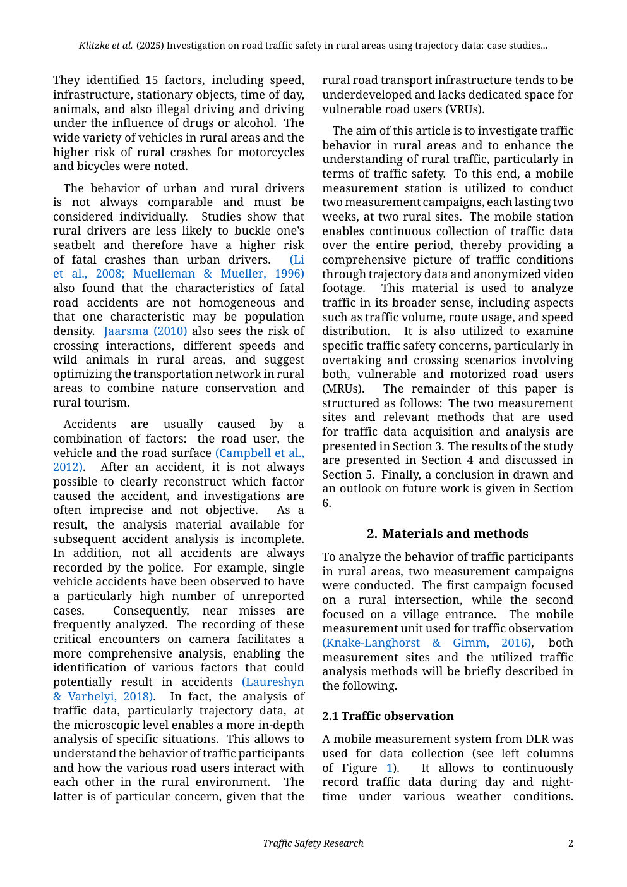

クリツケら。 (2025) 軌跡データを使用した農村部の道路交通安全に関する調査: ケーススタディ... 彼らは、速度、インフラ、静止物体、時間帯、動物、さらに違法運転や薬物またはアルコールの影響下での運転を含む 15 の要因を特定しました。農村部では多種多様な車両が存在し、田舎ではオートバイや自転車の事故のリスクが高いことが指摘されています。都市部と地方のドライバーの行動は必ずしも比較できるわけではなく、個別に考慮する必要があります。研究によると、田舎のドライバーはシートベルトを締める可能性が低いため、都市部のドライバーよりも死亡事故のリスクが高いことがわかっています。 (Li et al., 2008; Muelleman & Mueller, 1996) はまた、交通死亡事故の特徴は均一ではなく、特徴の 1 つは人口密度である可能性があることを発見しました。 Jaarsma (2010) はまた、農村地域における相互交流、異なる速度、野生動物の危険性を認識しており、自然保護と農村観光を組み合わせるために農村地域の交通ネットワークを最適化することを提案しています。事故は通常、道路利用者、車両、路面などの要因の組み合わせによって引き起こされます (Campbell et al.、2012)。事故後、どの要因が事故を引き起こしたのかを明確に再現できるとは限らず、調査は不正確で客観的でないことがよくあります。その結果、その後の事故分析に利用できる分析資料は不完全です。さらに、すべての事故が警察によって常に記録されるわけではありません。たとえば、単独の車両事故では、報告されていない件数が特に多いことが観察されています。したがって、ニアミスは頻繁に分析されます。これらの重大な遭遇をカメラで記録することで、より包括的な分析が容易になり、事故を引き起こす可能性のあるさまざまな要因を特定することが可能になります (Laureshyn & Varhelyi、2018)。実際、交通データ、特に軌跡データを顕微鏡レベルで分析すると、特定の状況をより詳細に分析できます。これにより、交通参加者の行動や、田舎の環境でさまざまな道路利用者がどのように相互作用するかを理解することができます。地方の道路交通インフラは未開発の傾向があり、道路交通弱者（VRU）専用のスペースが不足していることを考えると、後者は特に懸念されます。この記事の目的は、農村部の交通行動を調査し、特に交通安全の観点から農村部の交通に対する理解を高めることです。この目的を達成するために、移動式測定ステーションを利用して、地方の 2 か所でそれぞれ 2 週間続く 2 回の測定キャンペーンを実施します。移動局は、全期間にわたる交通データの継続的な収集を可能にし、それにより、軌跡データと匿名化されたビデオ映像を通じて交通状況の包括的な画像を提供します。交通量や路線利用状況、速度分布など、広い意味での交通を分析するための資料です。また、特に交通弱者と自動車道路利用者 (MRU) の両方が関与する追い越しや横断のシナリオにおける、特定の交通安全上の懸念を調査するためにも利用されます。この文書の残りの部分は次のように構成されています: 交通データの取得と分析に使用される 2 つの測定サイトと関連する方法がセクション 3 で示されます。研究の結果がセクション 4 で示され、セクション 5 で議論されます。最後に、導かれた結論と今後の作業の見通しがセクション 6 で示されます。 2. 材料と方法 農村部の交通参加者の行動を分析するために、2 つの測定キャンペーンが実施されました。最初のキャンペーンは田舎の交差点に焦点を当て、2 番目のキャンペーンは村の入り口に焦点を当てました。交通観測に使用されるモバイル測定ユニット (Knake-Langhorst & Gimm、2016)、両方の測定サイト、および利用された交通分析方法について、以下に簡単に説明します。 2.1 交通観測 データ収集には DLR のモバイル測定システムが使用されました (図 1 の左列を参照)。昼夜を問わずさまざまな天候下で交通データを継続的に記録できます。

条件。交通安全研究2

## ページ 3

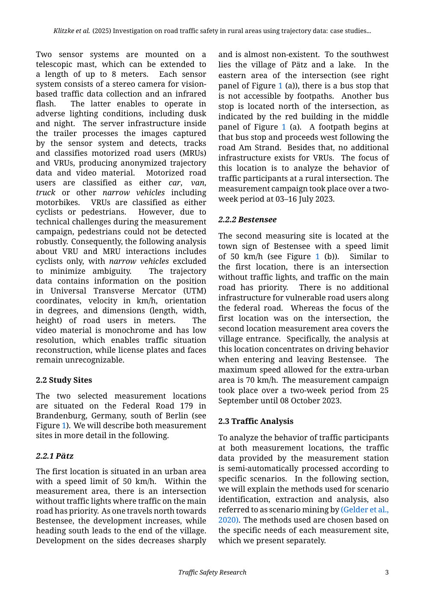

クリツケら。 (2025) 軌跡データを用いた農村部の交通安全に関する調査: ケーススタディ... 2 つのセンサー システムが、最大 8 メートルの長さまで伸ばすことができる伸縮式マストに取り付けられています。各センサー システムは、ビジョンベースの交通データ収集用のステレオ カメラと赤外線フラッシュで構成されます。後者は、夕暮れや夜間などの不利な照明条件でも動作できます。トレーラー内のサーバー インフラストラクチャは、センサー システムによってキャプチャされた画像を処理し、電動道路利用者 (MRU) と VRU を検出、追跡、分類して、匿名化された軌跡データとビデオ素材を生成します。自動車による道路利用者は、乗用車、バン、トラック、またはバイクを含むその他の幅の狭い車両に分類されます。 VRU は自転車または歩行者に分類されます。しかし、測定キャンペーン中の技術的な課題により、歩行者を確実に検出できませんでした。したがって、VRU と MRU の相互作用に関する以下の分析には、曖昧さを最小限に抑えるために狭い車両は除外され、自転車のみが含まれています。軌跡データには、ユニバーサル横メルカトル (UTM) 座標での位置、km/h での速度、度での方向、およびメートルでの道路利用者の寸法 (長さ、幅、高さ) に関する情報が含まれています。映像素材はモノクロで解像度が低いため、ナンバープレートや顔は認識できないものの、交通状況の再現が可能です。 2.2 調査場所 選択された 2 つの測定場所は、ベルリンの南、ドイツのブランデンブルクにある連邦道 179 号線沿いにあります (図 1 を参照)。両方の測定サイトについては、以下でさらに詳しく説明します。 2.2.1 パッツ 最初の場所は都市部にあり、制限速度は 50 km/h です。測定エリア内には、本線通行が優先される信号機のない交差点があります。ベステンゼーに向かって北に進むと開発が進み、南に向かうと村の終わりにつながります。側面の発達は急激に減少し、ほとんど存在しません。南西にはペッツ村と湖があります。交差点の東側エリア（図1(a)の右パネル参照）には、歩道ではアクセスできないバス停があります。図 1 (a) の中段の赤い建物で示されているように、別のバス停が交差点の北にあります。歩道はそのバス停から始まり、Am Strand 道路に沿って西に進みます。それ以外に、VRU 用の追加のインフラストラクチャは存在しません。この場所の焦点は、田舎の交差点での交通参加者の行動を分析することです。測定キャンペーンは、2023 年 7 月 3 日から 16 日までの 2 週間にわたって実施されました。 2.2.2 ベステンゼー 2 番目の測定サイトは、制限速度 50 km/h のベステンゼーの町の標識にあります (図 1 (b) を参照)。最初の場所と同様に、信号のない交差点があり、幹線道路の交通が優先されます。連邦道路沿いには交通弱者の道路利用者のための追加のインフラはありません。最初の位置の焦点は交差点にありましたが、2 番目の位置の測定エリアは村の入り口をカバーしています。具体的には、この場所での分析は、ベステンゼーに出入りするときの運転行動に焦点を当てています。都市部外の最高速度は 70 km/h です。測定キャンペーンは、2023 年 9 月 25 日から 10 月 8 日までの 2 週間にわたって実施されました。 2.3 交通分析 両方の測定場所での交通参加者の行動を分析するために、測定ステーションから提供された交通データは、特定のシナリオに従って半自動的に処理されます。次のセクションでは、シナリオの特定、抽出、分析に使用される方法 (Gelder et al., 2020) によってシナリオ マイニングとも呼ばれる方法について説明します。使用される方法は、各測定サイトの特定のニーズに基づいて選択されます。これについては、別途説明します。交通安全研究3

## ページ 4

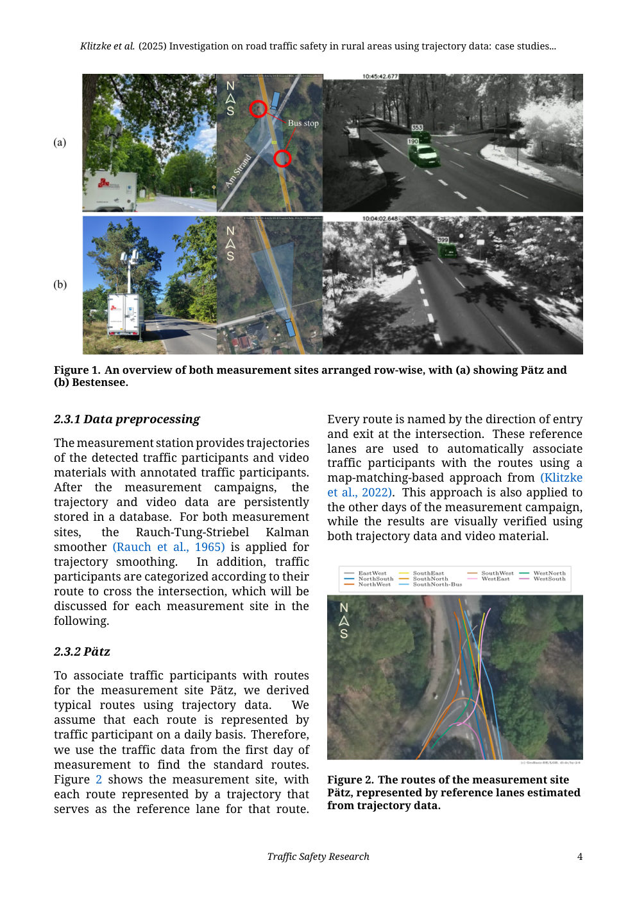

クリツケら。 (2025) 軌跡データを使用した農村部の道路交通安全に関する調査: ケーススタディ... 図 1. 行ごとに配置された両方の測定サイトの概要。(a) はペッツを示し、(b) はベステンゼーを示しています。 2.3.1 データの前処理 測定ステーションは、検出された交通参加者の軌跡と、注釈付きの交通参加者を含むビデオ素材を提供します。測定キャンペーンの後、軌跡とビデオ データはデータベースに永続的に保存されます。両方の測定部位について、軌道平滑化のために Rauch-Tung-Striebel カルマン スムーザー (Rauch et al.、1965) が適用されます。また、交通参加者は交差点を通過するルートに応じて分類されますが、これについては測定サイトごとに説明します。 2.3.2 パッツ 交通参加者を測定サイト パッツのルートに関連付けるために、軌跡データを使用して典型的なルートを導き出しました。各ルートには毎日交通参加者が参加していると想定します。そこで、計測初日の交通データを利用して標準ルートを求めます。図 2 は、測定サイトを示しています。各ルートは、そのルートの基準車線として機能する軌跡で表されます。すべてのルートは、交差点への進入と退出の方向によって名前が付けられます。これらの基準車線は、(Klitzke et al.、2022) のマップマッチングベースのアプローチを使用して、交通参加者をルートに自動的に関連付けるために使用されます。このアプローチは他の日の測定キャンペーンにも適用され、結果は軌跡データとビデオ素材の両方を使用して視覚的に検証されます。図 2. 軌跡データから推定された基準車線で表された、測定地点パッツのルート。交通安全研究4

## ページ 5

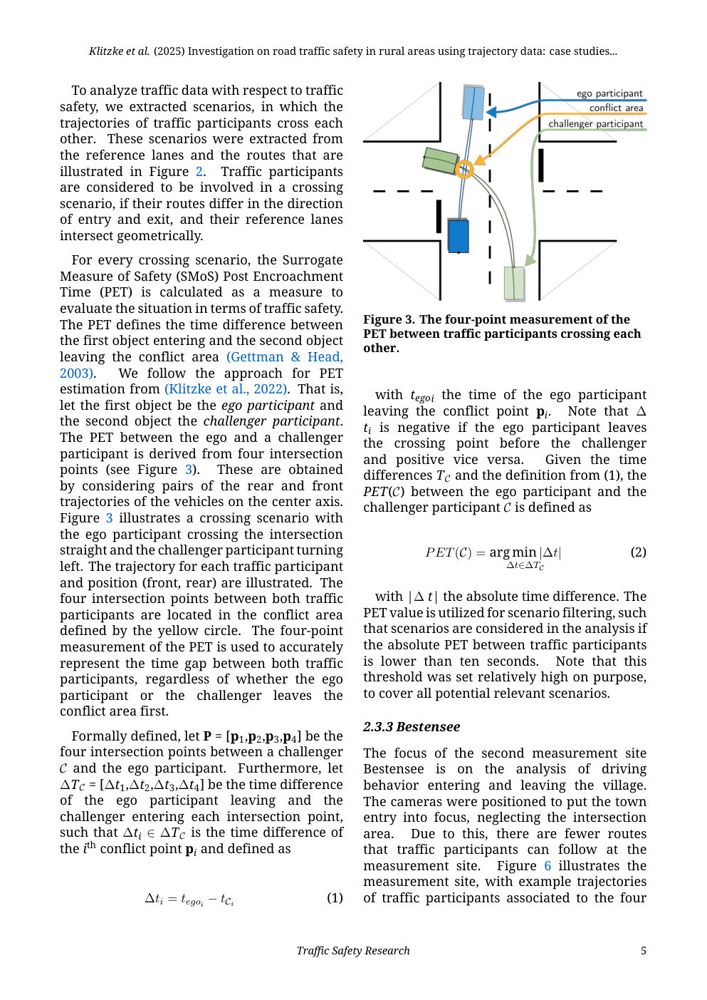

クリツケら。 (2025) 軌跡データを用いた農村部の交通安全に関する調査: 事例研究... 交通安全に関する交通データを分析するために、交通参加者の軌跡が交差するシナリオを抽出しました。これらのシナリオは、図 2 に示されている基準車線とルートから抽出されたものです。交通参加者のルートの進入方向と退出方向が異なり、基準車線が幾何学的に交差する場合、交通参加者は横断シナリオに関与していると見なされます。すべての横断シナリオについて、交通安全の観点から状況を評価するための尺度として、SMoS (Surrogate Measure of Safety) の侵入後時間 (PET) が計算されます。 PET は、最初の物体が衝突領域に進入し、2 番目の物体が衝突領域から出るまでの時間差を定義します (Gettman & Head、2003)。 PET 推定のアプローチは (Klitzke et al.、2022) に従います。つまり、最初のオブジェクトをエゴ参加者、2 番目のオブジェクトをチャレンジャー参加者とします。自我と挑戦者参加者の間の PET は 4 つの交点から導出されます (図 3 を参照)。これらは、中心軸上の車両の後部と前部の軌跡のペアを考慮することによって得られます。図 3 は、自我参加者が交差点を真っ直ぐ横断し、チャレンジャー参加者が左折する交差点シナリオを示しています。各交通参加者の軌跡と位置（前方、後方）が示されます。両方の交通参加者間の 4 つの交差点は、黄色の円で定義された衝突エリア内にあります。 PET の 4 点測定は、エゴ参加者とチャレンジャーのどちらが先に紛争地域を離れるかに関係なく、両方の交通参加者間の時間差を正確に表すために使用されます。正式に定義すると、P = [ p1,p2,p3,p4] を挑戦者 C と自我参加者の間の 4 つの交点とします。さらに、∆TC = [ ∆t1,∆t2,∆t3,∆t4] を、エゴ参加者が出発し、挑戦者が各交点に入る時間差とします。 ∆ti ∈ ∆TC は、i 番目の衝突点 pi の時間差であり、 ∆ti = tegoi − tCi (1) と定義されます。 図 3. 間の PET の 4 点測定交差する交通参加者。テゴイとは、自我参加者が衝突点 pi から離れる時刻です。自我参加者が挑戦者よりも先に交差点を離れた場合、Δ ti は負であり、その逆の場合は正であることに注意してください。時間差 TC と (1) の定義を考慮すると、エゴ参加者とチャレンジャー参加者 C の間の PET(C) は次のように定義されます。 P ET (C) = arg min |Δt| Δt∈ΔTC (2) |Δt|絶対的な時間差。 PET 値はシナリオ フィルタリングに利用され、トラフィック参加者間の絶対 PET が 10 秒未満の場合にシナリオが分析で考慮されます。このしきい値は、潜在的な関連シナリオをすべてカバーするために、意図的に比較的高く設定されていることに注意してください。 2.3.3 Bestensee 2 番目の測定サイト Bestensee の焦点は、村に出入りする運転行動の分析にあります。カメラは町の入り口に焦点を当てるように配置され、交差点エリアは無視されました。このため、測定現場で交通参加者がたどることのできる経路が少なくなります。図 6 は、4 つの交通安全研究に関連する交通参加者の軌跡の例を示す測定サイトを示しています。

## ページ 6

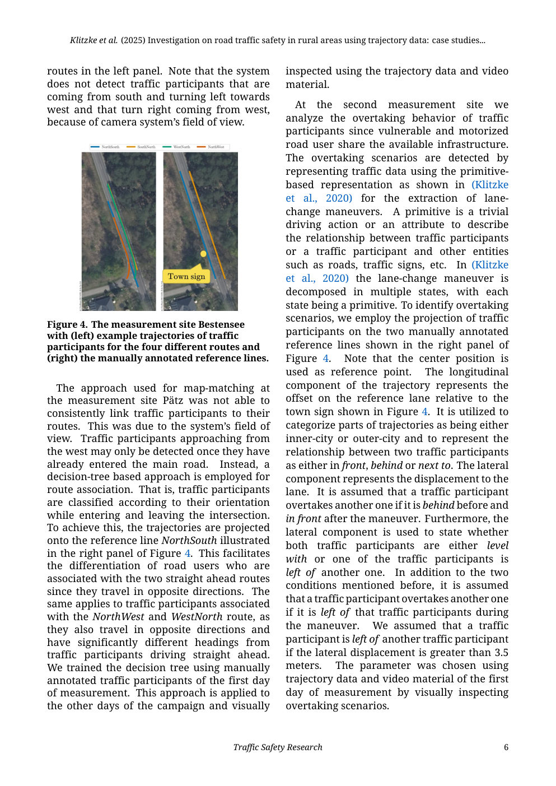

クリツケら。 (2025) 軌跡データを使用した農村部の交通安全に関する調査: ケーススタディ... 左パネルのルート。カメラ システムの視野の関係で、システムは、南から来て西に向かって左折する交通参加者と、西から来て右折する交通参加者を検出しないことに注意してください。図 4. 測定サイト Bestensee と、(左) 4 つの異なるルートの交通参加者の軌跡の例、および (右) 手動で注釈が付けられた基準線。パッツの測定現場でマップ マッチングに使用されたアプローチでは、交通参加者をルートに一貫して結び付けることができませんでした。これはシステムの視野によるものでした。西側から接近する交通参加者は、主要道路に入った後でのみ検出される可能性があります。代わりに、決定木ベースのアプローチがルートの関連付けに使用されます。つまり、交通参加者は、交差点に出入りするときの方向に応じて分類されます。これを達成するために、図 4 の右パネルに示されている基準線 NorthSouth に軌跡が投影されます。これにより、2 つの直進ルートは反対方向に移動するため、これらのルートに関連付けられた道路利用者の区別が容易になります。同じことが、NorthWest ルートと WestNorth ルートに関連付けられた交通参加者にも当てはまります。これは、これらの交通参加者も反対方向に移動し、直進する交通参加者とは進行方向が大きく異なるためです。測定初日の手動で注釈を付けた交通参加者を使用して、デシジョン ツリーをトレーニングしました。このアプローチはキャンペーンの他の日にも適用され、軌跡データとビデオ素材を使用して視覚的に検査されます。 2 番目の測定サイトでは、交通弱者と自動車道路利用者が利用可能なインフラを共有しているため、交通参加者の追い越し行動を分析します。追い越しシナリオは、車線変更操作の抽出に関して (Klitzke et al.、2020) に示されているように、プリミティブベースの表現を使用して交通データを表すことによって検出されます。プリミティブとは、些細な運転操作、または交通参加者または交通参加者と道路、交通標識などの他のエンティティとの関係を記述するための属性です。(Klitzke et al.、2020) では、車線変更操作は複数の状態に分解され、各状態がプリミティブとなります。追い越しのシナリオを特定するために、図 4 の右パネルに示す手動で注釈を付けた 2 つの基準線上に交通参加者の投影を採用します。中心位置が基準点として使用されることに注意してください。軌跡の縦方向の成分は、図 4 に示す市街標識に対する基準車線のオフセットを表します。これは、軌跡の一部を都市部か都市部外かに分類し、2 人の交通参加者の関係を前、後ろ、隣のいずれかとして表すために利用されます。横方向の成分は車線までの変位を表します。交通参加者が操縦前に後ろにいて、操縦後に前にいた場合、別の参加者を追い越すと想定されます。さらに、横方向コンポーネントは、両方の交通参加者が同じレベルにいるか、または交通参加者の一方が別の参加者から離れているかを示すために使用されます。前述の 2 つの条件に加えて、操作中に交通参加者がその交通参加者から離れた場合、別の交通参加者を追い越すことが想定されます。横方向の変位が 3.5 メートルを超える場合、交通参加者が別の交通参加者から取り残されると仮定しました。パラメータは、追い越しシナリオを目視検査することにより、測定初日の軌跡データとビデオ素材を使用して選択されました。交通安全研究6

## ページ 7

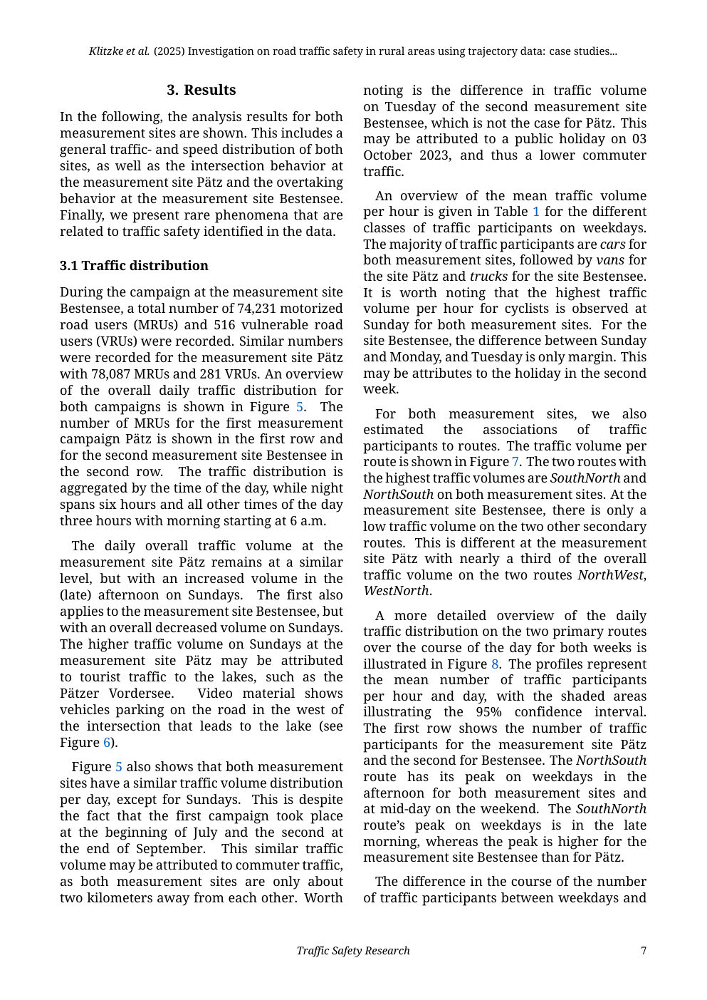

クリツケら。 (2025) 軌跡データを用いた農村部の交通安全に関する調査: 事例研究... 3. 結果 以下に、両測定サイトの分析結果を示します。これには、両方のサイトの一般的な交通量と速度の分布に加え、測定サイトのペッツでの交差点の動作と測定サイトのベステンゼーでの追い越しの動作が含まれます。最後に、データから特定された交通安全に関連する稀な現象を紹介します。 3.1 交通量分布 測定サイト Bestensee でのキャンペーン中、合計 74,231 人の自動車道路利用者 (MRU) と 516 人の交通弱者 (VRU) が記録されました。測定サイトのパッツでも同様の数値が記録され、MRU は 78,087 台、VRU は 281 台でした。両方のキャンペーンの全体的な 1 日のトラフィック分布の概要を図 5 に示します。最初の測定キャンペーン Pätz の MRU 数が 1 行目に、2 番目の測定サイト Bestensee の MRU 数が 2 行目に示されています。交通量の分布は 1 日の時間帯によって集計され、夜間は午前 6 時に始まる朝から ​​6 時間、その他の時間帯は 3 時間に及びます。測定サイトのパッツにおける 1 日の全体的な交通量は同様のレベルのままですが、日曜日の午後 (遅く) に増加しています。 1 つ目は測定サイト Bestensee にも当てはまりますが、日曜日の全体的な量は減少します。測定地ペッツの日曜日の交通量が多いのは、ペッツァー・フォルダー湖などの湖への観光客の流入によるものと考えられます。ビデオ資料には、湖につながる交差点の西側の道路に駐車する車両が示されています (図 6 を参照)。図 5 は、日曜日を除いて、両方の測定サイトの 1 日あたりのトラフィック量分布が同様であることも示しています。これは、最初のキャンペーンが 7 月初めに行われ、2 番目が 9 月末に行われたという事実にもかかわらずです。両方の測定サイトは互いにわずか約 2 キロメートルしか離れていないため、この同様の交通量は通勤交通によるものである可能性があります。注目に値するのは、2番目の測定地点であるベステンゼーの火曜日の交通量の違いであるが、ペッツの場合はそうではない。これは、2023 年 10 月 3 日が祝日であり、通勤者の交通量が少なかったためと考えられます。表 1 は、平日のさまざまなクラスの交通参加者に対する 1 時間あたりの平均交通量の概要を示しています。両測定サイトの交通参加者の大多数は乗用車で、次にペッツ測定サイトのバン、ベステンゼ測定サイトのトラックが続きます。注目に値するのは、自転車利用者の時間当たりの交通量が最も多くなるのは、どちらの測定場所でも日曜日であるということです。 Bestensee サイトの場合、日曜日と月曜日、火曜日の差はほんのわずかです。これは2週目の休日の影響かもしれません。両方の測定サイトについて、交通参加者のルートとの関連性も推定しました。路線ごとの交通量を図7に示す。どちらの測定サイトでも、交通量が最も多い 2 つのルートは SouthNorth と NorthSouth です。測定サイトのベステンゼーでは、他の 2 つの二次ルートの交通量が少ないだけです。これは、北西、西北の 2 つのルートで全体の交通量の 3 分の 1 近くを占める測定サイトのペッツでは異なります。両週の 1 日にわたる 2 つの主要ルートの 1 日あたりの交通量分布のより詳細な概要を図 8 に示します。プロファイルは、1 時間および 1 日あたりの交通参加者の平均数を表し、影付きの領域は 95% 信頼区間を示しています。最初の行は測定サイト Pätz の交通参加者数を示し、2 番目の行は Bestensee の交通参加者数を示します。南北ルートのピークは両測定地とも平日の午後、週末の正午に発生する。南北ルートの平日のピークは早朝ですが、測定地ベステンゼーのピークはペッツよりも高くなります。平日と交通安全調査7の交通参加者数の推移の違い

## ページ 8

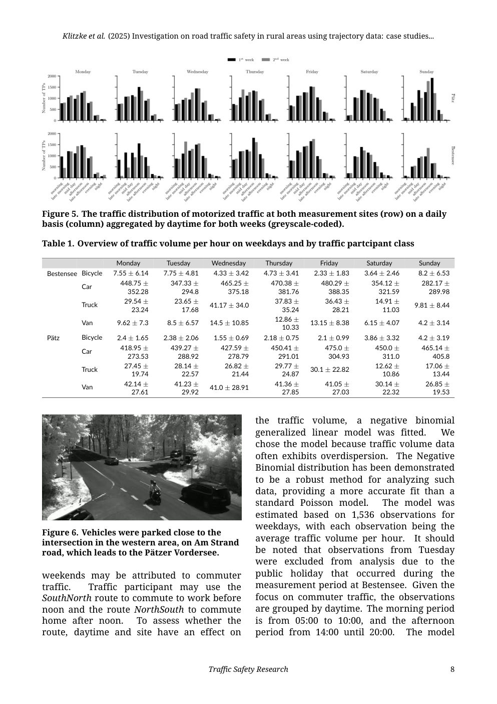

クリツケら。 (2025) 軌跡データを使用した農村部の道路交通安全に関する調査: ケーススタディ... 図 5. 両方の週の日中ごとに集計された、両方の測定サイト (行) の日ベース (列) での自動車交通の交通量分布 (グレースケール コード)。表 1 平日の時間当たり交通量の概要と交通参加者階級別 月曜 火曜 水曜 木曜 金曜 土曜 日曜 ベステンセ 自転車 7.55 ± 6.14 7.75 ± 4.81 4.33 ± 3.42 4.73 ± 3.41 2.33 ± 1.83 3.64 ± 2.46 8.2 ± 6.53乗用車 448.75 ± 352.28 347.33 ± 294.8 465.25 ± 375.18 470.38 ± 381.76 480.29 ± 388.35 354.12 ± 321.59 282.17 ± 289.98 トラック29.54 ± 23.24 23.65 ± 17.68 41.17 ± 34.0 37.83 ± 35.24 36.43 ± 28.21 14.91 ± 11.03 9.81 ± 8.44 バン 9.62 ± 7.3 8.5 ± 6.57 14.5 ± 10.85 12.86 ± 10.33 13.15 ± 8.38 6.15 ± 4.07 4.2 ± 3.14 パッツ自転車 2.4 ± 1.65 2.38 ± 2.06 1.55 ± 0.69 2.18 ± 0.75 2.1 ± 0.99 3.86 ± 3.32 4.2 ± 3.19 自動車 418.95 ± 273.53 439.27 ± 288.92 427.59 ± 278.79 450.41 ± 291.01 475.0 ± 304.93 450.0 ± 311.0 465.14 ± 405.8 トラック 27.45 ± 19.74 28.14 ± 22.57 26.82 ± 21.44 29.77 ± 24.87 30.1 ± 22.82 12.62 ± 10.86 17.06 ± 13.44 バン 42.14 ± 27.61 41.23 ± 29.92 41.0 ± 28.91 41.36 ± 27.85 41.05 ± 27.03 30.14 ± 22.32 26.85 ± 19.53 図 6. 車両は交差点の近くに駐車された西エリアのアム・ストランド通り沿いにあり、ペッツァー・フォルダーゼーに通じています。週末は通勤者の渋滞が原因である可能性があります。交通参加者は、正午前に通勤するために南北ルートを使用し、正午以降に帰宅するために北南ルートを使用する可能性があります。ルート、日中、場所が交通量に影響を与えるかどうかを評価するために、負の二項一般化線形モデルを当てはめました。交通量データが過分散を示すことが多いため、このモデルを選択しました。負の二項分布は、このようなデータを分析するための堅牢な方法であることが実証されており、標準のポアソン モデルよりも正確な適合が得られます。このモデルは、平日の 1,536 件の観測値に基づいて推定され、各観測値は 1 時間あたりの平均交通量でした。ベステンゼーでの測定期間中に祝日があったため、火曜日からの観測は分析から除外されたことに注意してください。通勤交通に焦点を当てているため、観測値は日中ごとにグループ化されています。午前の部は05:00～10:00、午後の部は14:00～20:00です。モデル交通安全研究8

## ページ 9

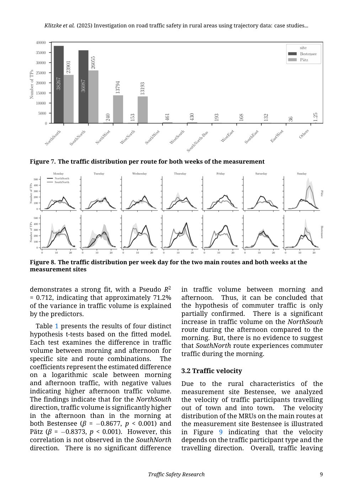

クリツケら。 (2025) 軌跡データを使用した農村部の道路交通安全性の調査: ケーススタディ... 図 7. 測定の両週のルートごとの交通量分布 図 8. 2 つの主要ルートと測定サイトの両週の 1 日あたりの交通量分布は、擬似 R2 = 0.712 で強い適合性を示し、交通量の分散の約 71.2% が予測変数によって説明されることを示しています。表 1 は、適合モデルに基づく 4 つの異なる仮説 t 検定の結果を示しています。各テストでは、特定のサイトとルートの組み合わせについて、午前と午後の交通量の違いを調べます。係数は午前と午後の交通量の推定差を対数スケールで表し、負の値は午後の交通量が多いことを示します。この結果は、北南方向では、ベステンゼー (β = −0.8677、p < 0.001) とペッツ (β = −0.8373、p < 0.001) の両方で、交通量が午前中よりも午後の方が大幅に多いことを示しています。ただし、この相関は南北方向では観察されません。午前と午後の交通量に大きな差はありません。したがって、通勤交通の仮説は部分的にしか確認されていないと結論付けることができます。南北ルートでは午後は午前中に比べて交通量が大幅に増加します。しかし、SouthNorth ルートで午前中に通勤者の渋滞が発生することを示唆する証拠はありません。 3.2 交通速度 測定場所ベステンゼーの田園地帯の特徴により、町から出て町に入る交通参加者の速度を分析しました。測定サイト Bestensee の主要ルート上の MRU の速度分布を図 9 に示します。これは、速度が交通参加者のタイプと進行方向に依存することを示しています。全体として、交通安全調査から出る交通量 9

## ページ 10

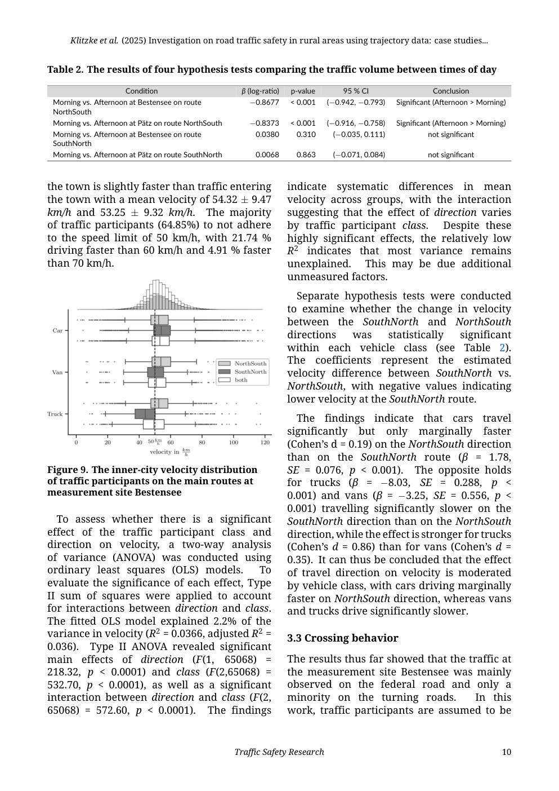

クリツケら。 (2025) 軌跡データを使用した農村部の道路交通安全に関する調査: ケーススタディ... 表 2. 時間帯間の交通量を比較した 4 つの仮説検定の結果 条件 β (対数比) p 値 95 % CI 結論 NorthSouth ルートのベステンゼーでの午前と午後 −0.8677 < 0.001 ( −0.942, −0.793) 有意 (午後 >午前) NorthSouth ルートのパッツでの午前と午後 −0.8373 < 0.001 ( -0.916, -0.758) 有意 (午後 > 午前) SouthNorth ルートのベステンゼでの午前と午後 0.0380 0.310 ( -0.035, 0.111) 有意ではない SouthNorth ルートのパッツでの午前と午後0.0068 0.863 ( -0.071, 0.084) 有意ではない。町は町に入る交通よりわずかに速く、平均速度は 54.32 ± 9.47 km/h および 53.25 ± 9.32 km/h です。交通参加者の大多数 (64.85%) は制限速度 50 km/h を遵守しておらず、21.74 % が 60 km/h 以上、4.91 % が 70 km/h 以上で運転しています。図 9. 測定サイト Bestensee の主要ルートにおける交通参加者の市内速度分布 速度に対する交通参加者のクラスと方向の有意な影響があるかどうかを評価するために、通常最小二乗 (OLS) モデルを使用して二元配置分散分析 (ANOVA) が実行されました。各効果の重要性を評価するために、タイプ II 平方和を適用して、方向とクラスの間の相互作用を説明しました。近似された OLS モデルは、速度の分散の 2.2% を説明しました (R2 = 0.0366、調整済み R2 = 0.036)。 Type II ANOVA では、方向 (F(1, 65068) = 218.32、p < 0.0001) とクラス (F(2,65068) = 532.70、p < 0.0001) の有意な主効果、および方向とクラス間の有意な交互作用 (F(2, 65068) = 572.60、p < 0.0001) が明らかになりました。この結果は、グループ間の平均速度の体系的な違いを示しており、交互作用は、方向の影響が交通参加者のクラスによって異なることを示唆しています。これらの非常に重要な効果にもかかわらず、比較的低い R2 は、ほとんどの分散が依然として説明されていないことを示しています。これは、測定されていない追加の要因によるものである可能性があります。南北方向と北南方向の間の速度の変化が各車両クラス内で統計的に有意であるかどうかを調べるために、個別の仮説検定が実施されました (表 2 を参照)。係数は、SouthNorth と NorthSouth の間の推定速度差を表し、負の値は SouthNorth ルートでの速度が低いことを示します。この結果は、車の移動速度は、南北ルートよりも北南方向のほうが大幅に速いものの、わずかに速いだけ (コーエンの d = 0.19) であることを示しています (β = 1.78、SE = 0.076、p < 0.001)。逆のことがトラック (β = −8.03、SE = 0.288、p < 0.001) とバン (β = −3.25、SE = 0.556、p < 0.001) に当てはまり、南北方向よりも南北方向の方が著しく遅く移動しますが、その影響はバン (コーエンの d = 0.86) よりもトラック (コーエンの d = 0.86) の方が強いです。 0.35）。したがって、進行方向が速度に及ぼす影響は車両クラスによって緩和され、車は南北方向ではわずかに速く走行するのに対し、バンやトラックは大幅に遅くなると結論付けることができます。 3.3 横断行動 これまでの結果から、測定地ベステンゼーの交通は主に連邦道路で観測され、曲がり角の交通は少数のみであることが示されました。この作品では交通参加者は交通安全研究10を想定しています。

## ページ 11

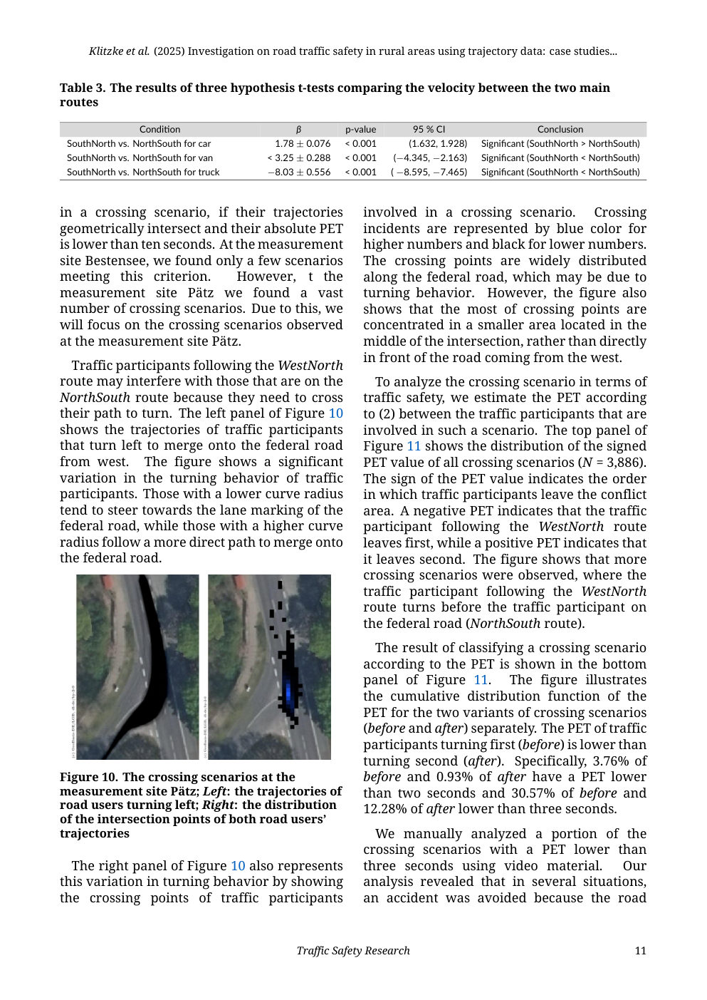

クリツケら。 (2025) 軌跡データを使用した農村部の道路交通安全性の調査: ケーススタディ... 表 3. 2 つの主要ルート間の速度を比較する 3 つの仮説 t 検定の結果 条件 β p 値 95 % CI 結論 自動車の SouthNorth 対 NorthSouth 1.78 ± 0.076 < 0.001 (1.632, 1.928) 有意 (SouthNorth > NorthSouth) SouthNorth 対バンの NorthSouth < 3.25 ± 0.288 < 0.001 ( −4.345, −2.163) 有意 (SouthNorth < NorthSouth) トラックの SouthNorth 対 NorthSouth −8.03 ± 0.556 < 0.001 ( −8.595, −7.465) 横断シナリオでは有意 (SouthNorth < NorthSouth)軌道は幾何学的に交差しており、絶対 PET は 10 秒未満です。測定サイト Bestensee では、この基準を満たすシナリオはわずか数件しか見つかりませんでした。しかし、測定サイトのペッツでは、膨大な数の横断シナリオが見つかりました。このため、測定サイトのパッツで観察された横断シナリオに焦点を当てます。西北ルートをたどる交通参加者は、方向転換するために道を横切る必要があるため、北南ルートの参加者を妨害する可能性があります。図 10 の左側のパネルは、西から連邦道路に合流するために左折する交通参加者の軌跡を示しています。この図は、交通参加者の方向転換行動に大きな変化があることを示しています。曲線半径が小さいものは連邦道路の車線境界線に向かってハンドルを切る傾向があり、曲線半径が大きいものはより直接的な経路をたどって連邦道路に合流します。図 10. 測定サイト Pätz での横断シナリオ。左: 左折する道路利用者の軌跡。右: 両方の道路利用者の軌跡の交差点の分布 図 10 の右のパネルも、交差点シナリオに関与する交通参加者の交差点を示すことで、方向転換動作のこの変化を表しています。交差インシデントは、数値が大きいほど青色で表され、数値が小さいほど黒色で表されます。交差点は連邦道路に沿って広く分布しており、これは方向転換の動作によるものと考えられます。ただし、この図は、交差点のほとんどが西から来る道路の真正面ではなく、交差点の中央に位置する狭いエリアに集中していることも示しています。交通安全の観点から交差点シナリオを分析するために、そのようなシナリオに関与する交通参加者間の(2)に従ってPETを推定します。図 11 の上部パネルは、すべての交差シナリオ (N = 3,886) の符号付き PET 値の分布を示しています。 PET 値の符号は、交通参加者が紛争地域から出る順序を示します。負の PET は、WestNorth ルートをたどる交通参加者が最初に出発することを示し、正の PET は、2 番目に出発することを示します。この図は、WestNorth ルートをたどる交通参加者が連邦道路 (NorthSouth ルート) の交通参加者よりも前に曲がるという、より多くの交差点シナリオが観察されたことを示しています。 PET に従って交差シナリオを分類した結果を図 11 の下のパネルに示します。この図は、交差シナリオの 2 つの変種 (前後) に対する PET の累積分布関数を個別に示しています。最初に曲がる交通参加者（前）の PET は、2 番目に曲がる（後）よりも低くなります。具体的には、前の 3.76% と後の 0.93% で 2 秒未満の PET があり、前の 30.57% と後の 12.28% が 3 秒未満でした。ビデオ素材を使用して、PET が 3 秒未満の横断シナリオの一部を手動で分析しました。私たちの分析により、道路交通安全研究のおかげでいくつかの状況で事故が回避されたことが明らかになりました 11

## ページ 12

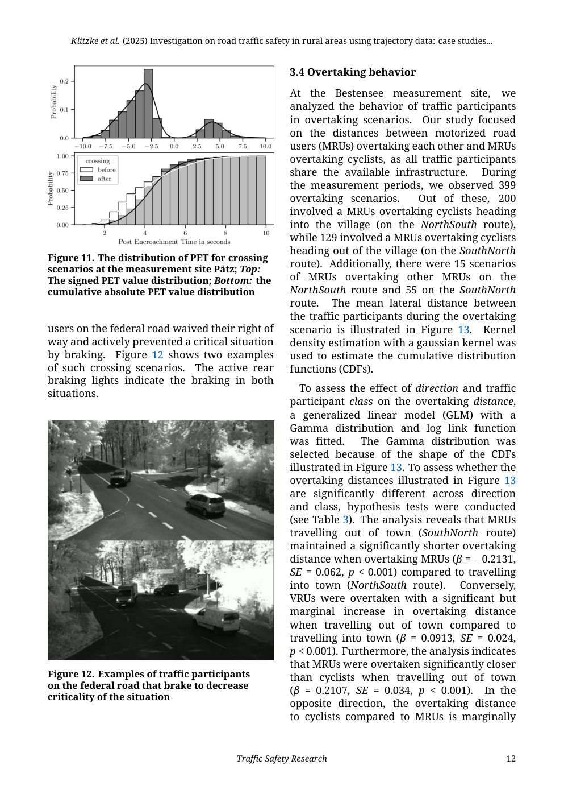

クリツケら。 (2025) 軌跡データを使用した農村部の道路交通安全に関する調査: ケーススタディ... 図 11. 測定サイト Pätz における横断シナリオの PET の分布。上: 符号付き PET 値の分布。下: 累積絶対 PET 値分布 連邦道路の利用者は優先権を放棄し、積極的にブレーキをかけて危機的状況を防止しました。図 12 は、そのような交差シナリオの 2 つの例を示しています。どちらの状況でも、アクティブな後部ブレーキ ライトがブレーキを示します。図 12. 事態の重大度を下げるためにブレーキをかける連邦道路上の交通参加者の例 3.4 追い越し行動 ベステンゼーの測定サイトで、追い越しシナリオにおける交通参加者の行動を分析しました。私たちの研究は、すべての交通参加者が利用可能なインフラを共有しているため、自動車道路利用者 (MRU) が互いに追い越し、自転車を追い越すまでの距離に焦点を当てました。測定期間中、399 件の追い越しシナリオが観察されました。このうち、200 件は村に向かう自転車を追い越す MRU (NorthSouth ルート) で、129 件は村から出る自転車を追い抜く MRU (SouthNorth ルート) でした。さらに、MRU が他の MRU を追い越すシナリオが NorthSouth ルートで 15 件、SouthNorth ルートで 55 件ありました。追い越しシナリオ中の交通参加者間の平均横距離を図 13 に示します。ガウス カーネルによるカーネル密度推定を使用して、累積分布関数 (CDF) を推定しました。方向と交通参加者クラスが追い越し距離に及ぼす影響を評価するために、ガンマ分布と対数リンク関数を備えた一般化線形モデル (GLM) がフィッティングされました。図 13 に示す CDF の形状のため、ガンマ分布が選択されました。図 13 に示す追い越し距離が方向やクラスによって大きく異なるかどうかを評価するために、仮説検定が実施されました (表 3 を参照)。分析の結果、町の外を走行する MRU (SouthNorth ルート) は、町に入る場合 (NorthSouth ルート) に比べて、MRU を追い越す際に大幅に短い追い越し距離 (β = −0.2131、SE = 0.062、p < 0.001) を維持したことが明らかになりました。逆に、VRU は、市内への移動と比較して、市外への移動では、追い越し距離が大幅ではあるもののわずかに増加しながら追い越されました (β = 0.0913、SE = 0.024、p < 0.001)。さらに、分析により、MRU は市外を走行する場合、自転車よりもかなり近い距離で追い越されたことが示されました (β = 0.2107、SE = 0.034、p < 0.001)。逆に、MRU と比較して自転車の追い越し距離はわずかです。 交通安全研究 12

## ページ 13

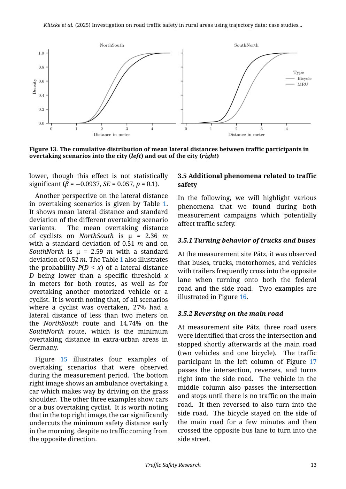

クリツケら。 (2025) 軌跡データを使用した農村部の道路交通安全性の調査: ケーススタディ... 図 13. 市内への追い越しシナリオ (左) と市外への追い越しシナリオ (右) における交通参加者間の平均横距離の累積分布は低くなりますが、この効果は統計的に有意ではありません (β = −0.0937、SE = 0.057、p = 0.1)。追い越しシナリオにおける横距離に関する別の観点を表 1 に示します。これは、さまざまな追い越しシナリオのバリエーションの平均横距離と標準偏差を示しています。北南地域の自転車の平均追い越し距離は μ = 2.36 m、標準偏差 0.51 m、南北地域では μ = 2.59 m、標準偏差 0.52 m です。表 1 は、両方のルート、および別の電動車両または自転車を追い越す場合の、横距離 D が特定のしきい値 x (メートル) より小さい確率 P(D < x) も示しています。注目に値するのは、自転車が追い抜かれたすべてのシナリオのうち、北南ルートでは横方向の距離が 27% 未満で、南北ルートでは 14.74% が横距離 2 メートル未満でした。これはドイツの都市部外での最小追い越し距離です。図 15 は、測定期間中に観察された追い越しシナリオの 4 つの例を示しています。右下の画像は、草の路肩を走行して道を譲る車を追い越す救急車を示しています。他の 3 つの例は、自転車を追い越す車またはバスを示しています。右上の画像では、対向車が来ていないにもかかわらず、早朝に車が最低安全距離を大幅に下回っていることに注目してください。 3.5 交通安全に関連するその他の現象 以下では、両方の測定キャンペーン中に発見された、交通安全に影響を与える可能性のあるさまざまな現象を取り上げます。 3.5.1 トラックとバスの方向転換動作 パッツの測定サイトでは、バス、トラック、キャンピングカー、トレーラー付き車両が、連邦道と側道の両方に方向転換する際に、対向車線に頻繁に横切ることが観察されました。 2 つの例を図 16 に示します。 3.5.2 本道での逆走 測定サイトのパッツでは、3 人の道路利用者が交差点を横断し、直後に本道で停止したことが確認されました (車両 2 台と自転車 1 台)。図 17 の左列の交通参加者は交差点を通過し、後退して右折して側道に入ります。中央列の車両も交差点を通過し、本線の交通量がなくなるまで停止します。その後、バックして側道にも曲がりました。自転車は数分間幹線道路の脇に留まった後、反対側のバスレーンを横切って脇道に入った。交通安全研究 13

## ページ 14

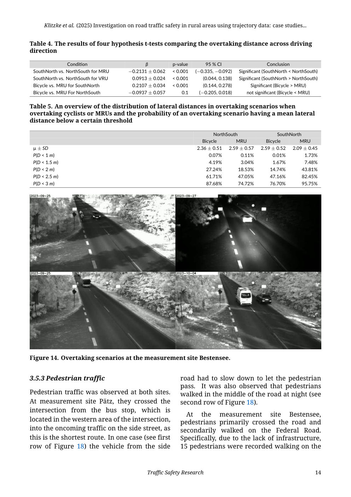

クリツケら。 (2025) 軌跡データを使用した農村部の道路交通安全性の調査: ケーススタディ... 表 4. 走行方向にわたる追い越し距離を比較する 4 つの仮説 t 検定の結果 条件 β p 値 95 % CI 結論 MRU の SouthNorth 対 NorthSouth −0.2131 ± 0.062 < 0.001 ( −0.335, −0.092) 有意 (SouthNorth < NorthSouth) VRU の SouthNorth 対 NorthSouth 0.0913 ± 0.024 < 0.001 (0.044, 0.138) 有意 (SouthNorth > NorthSouth) SouthNorth の自転車 vs. MRU 0.2107 ± 0.034 < 0.001 (0.144, 0.278) 有意 (自転車 > MRU) 自転車 vs. MRU NorthSouth −0.0937 ± 0.057 0.1 ( −0.205, 0.018) 有意ではない (自転車 < MRU) 表 5. 自転車または MRU を追い越すときの追い越しシナリオにおける横距離の分布の概要と、平均横距離が特定のしきい値を下回る追い越しシナリオの確率 NorthSouth SouthNorth 自転車 MRU 自転車 MRU μ ± SD 2.36 ± 0.51 2.59 ± 0.57 2.59 ± 0.52 2.09 ± 0.45 P(D < 1 m) 0.07% 0.11% 0.01% 1.73% P(D < 1.5 m) 4.19% 3.04% 1.67% 7.48% P(D < 2 m) 27.24% 18.53% 14.74% 43.81% P(D < 2.5 m) 61.71% 47.05% 47.16% 82.45% P(D < 3 m) 87.68% 74.72% 76.70% 95.75% 図 14. 測定サイトでの追い越しシナリオベステンゼー。 3.5.3 歩行者交通 両現場で歩行者交通が観察された。測定地ペッツでは、最短ルートであるため、交差点の西側にあるバス停から脇道で対向車に向かって交差点を横断しました。あるケースでは (図 18 の最初の行を参照)、側道から来た車両は歩行者を追い越すために速度を落とす必要がありました。歩行者が夜間に道路の真ん中を歩いていることも観察されました (図 18 の 2 行目を参照)。測定場所のベステンゼーでは、歩行者は主に道路を横断し、二次的に連邦道路を歩きました。具体的には、インフラの不足により、15 人の歩行者が交通安全調査 14 の上を歩いていることが記録されています。

## ページ 15

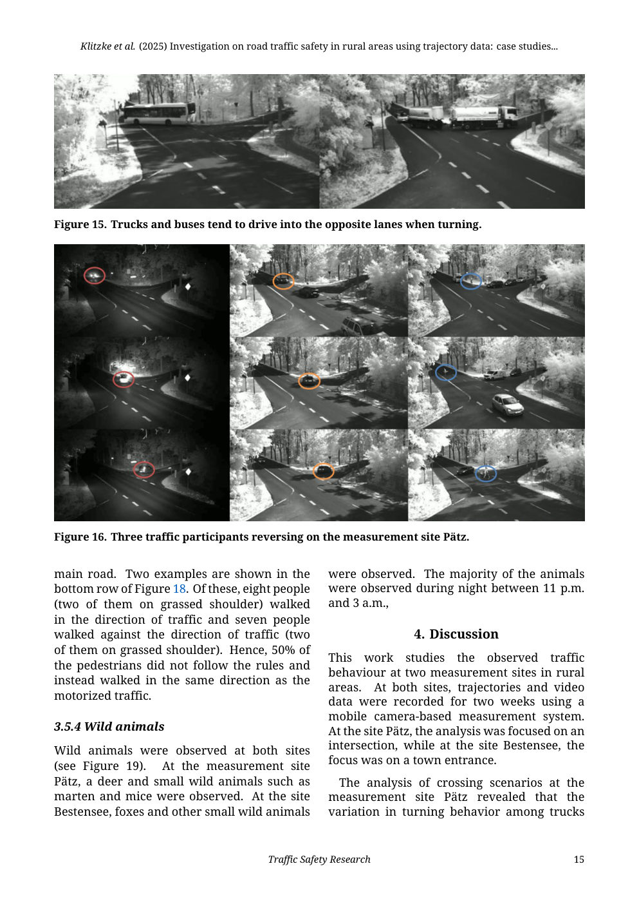

クリツケら。 (2025) 軌跡データを使用した農村部の道路交通安全に関する調査: ケーススタディ... 図 15. トラックとバスは、曲がるときに対向車線に突っ込む傾向があります。図 16. 測定サイト Pätz でバックする 3 人の交通参加者。主要道路。図 18 の下の行に 2 つの例を示します。このうち 8 人 (うち 2 人は芝生の路肩) が車の進行方向に歩き、7 人は車の進行方向に逆らって歩きました (そのうち 2 人は芝生の路肩)。したがって、歩行者の 50% は規則に従わず、自動車交通と同じ方向に歩いていました。 3.5.4 野生動物 野生動物は両方の場所で観察されました (図 19 を参照)。測定地ペッツでは、シカやテン、ネズミなどの小野生動物が観察されました。ベステンゼー遺跡では、キツネやその他の小さな野生動物が観察されました。動物の大部分は午後11時から午後11時までの間の夜間に観察されました。考察 この研究では、農村部の 2 つの測定サイトで観察された交通行動を研究しています。両方の現場で、移動カメラベースの測定システムを使用して、軌跡とビデオ データが 2 週間記録されました。 Pätz サイトでは交差点に焦点が当てられ、Bestensee サイトでは町の入り口に焦点が当てられました。パッツ測定現場での交差点シナリオの分析により、トラック間の旋回挙動にばらつきがあることが明らかになりました。 交通安全研究 15

## ページ 16

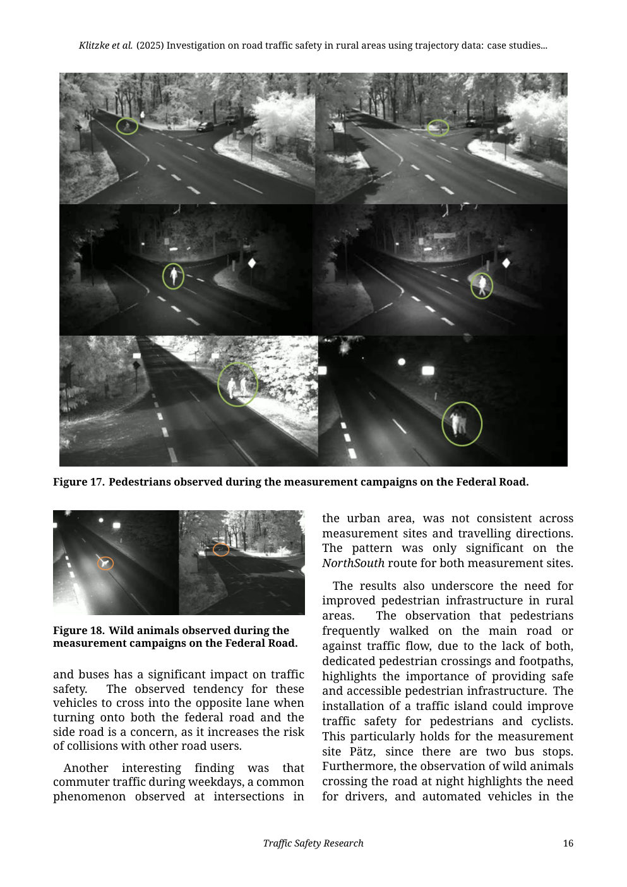

クリツケら。 (2025) 軌跡データを使用した農村部の道路交通安全に関する調査: ケーススタディ... 図 17. 連邦道路での測定キャンペーン中に観察された歩行者。図 18. 連邦道路での測定キャンペーン中に観察された野生動物。バスは交通安全に大きな影響を与えます。これらの車両が連邦道路と側道の両方に曲がるときに対向車線に横切る傾向が観察されており、他の道路利用者との衝突の危険が高まるため懸念されています。もう一つの興味深い発見は、都市部の交差点でよく観察される平日の通勤交通量が、測定場所や進行方向によって一貫していないことです。このパターンは、両方の測定サイトの北南ルートでのみ顕著でした。この結果はまた、農村地域における歩行者インフラの改善の必要性を浮き彫りにしています。専用の横断歩道と歩道が両方とも欠如しているため、歩行者が幹線道路や交通の流れに逆らって頻繁に歩いているという観察は、安全でアクセスしやすい歩行者インフラを提供することの重要性を浮き彫りにしています。交通島の設置により、歩行者と自転車の交通安全が向上する可能性があります。これは、バス停が 2 つあるため、測定サイトのパッツに特に当てはまります。さらに、夜間に道路を横切る野生動物の観察は、交通安全研究におけるドライバーと自動運転車の必要性を浮き彫りにしています16。

## ページ 17

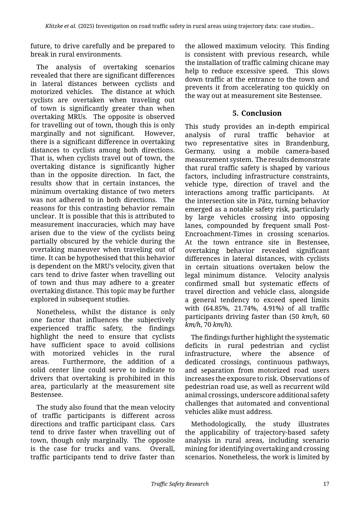

クリツケら。 (2025) 軌跡データを使用した農村部の交通安全に関する調査: ケーススタディ... 今後、慎重に運転し、田舎の環境での侵入に備えてください。追い越しシナリオの分析により、自転車と電動車両とでは横方向の距離に大きな違いがあることが明らかになりました。自転車が町の外を走行するときに追い越される距離は、MRU を追い越すときよりもはるかに長くなります。市外への旅行ではその逆が観察されますが、これはほんのわずかであり、重要ではありません。ただし、自転車の追い越し距離には両方向で大きな違いがあります。つまり、自転車が町の外を走行する場合、追い越し距離は逆方向に走行する場合よりも大幅に長くなります。実際、結果は、場合によっては、両方向とも 2 メートルの最低追い越し距離が守られていないことを示しています。この対照的な動作の理由はまだ不明です。これは、時間外に走行した場合の追い越し操作中に、自転車の視界が車両によって部分的に隠されるために発生した測定の不正確さに起因する可能性があります。車は町の外を走行するときにより速く運転する傾向があり、そのため追い越し距離を長く保つ可能性があることを考えると、この動作は MRU の速度に依存していると仮説が立てられます。このトピックは、今後の研究でさらに詳しく調査される可能性があります。それにもかかわらず、距離は主観的に経験される交通安全に影響を与える要因の 1 つにすぎませんが、この調査結果は、田舎で電動車両との衝突を避けるために自転車に十分なスペースを確保する必要性を浮き彫りにしています。さらに、実線のセンターラインを追加すると、このエリア、特に測定場所ベステンゼーでは追い越しが禁止されていることをドライバーに示すことができます。この研究では、交通参加者の平均速度が方向や交通参加者のクラスによって異なることもわかりました。わずかではありますが、町の外を移動するときの車の速度が速くなる傾向があります。トラックやバンの場合はその逆です。全体として、交通参加者は許容最大速度よりも速く運転する傾向があります。この発見は以前の研究と一致しているが、交通鎮静シケインの設置は過剰な速度を減らすのに役立つ可能性がある。これにより、町の入り口で交通が減速し、測定地ベステンゼーでの出口での急激な加速が防止されます。 5. 結論 この研究は、モバイルカメラベースの測定システムを使用して、ドイツのブランデンブルクにある 2 つの代表的な場所における農村部の交通行動の詳細な実証分析を提供します。この結果は、地方の交通安全がインフラの制約、車両の種類、進行方向、交通参加者間の相互作用などのさまざまな要因によって形作られることを示しています。パッツの交差点現場では、特に大型車両が対向車線に横断することによる方向転換動作が顕著な安全上のリスクとして浮上し、横断シナリオで頻繁に発生する短い侵入後時間によってさらに悪化しました。ベステンゼーの町入口付近では、追い越し行動により横方向の距離に大きな違いがあり、特定の状況では法定の最小距離を下回って自転車が追い越されることが明らかになった。速度分析では、交通参加者全体（64.85%、21.74%、4.91%）が（50 km/h、60 km/h、70 km/h）よりも速く運転し、制限速度を超える一般的な傾向とともに、進行方向と車両クラスの小さいながらも系統的な影響が確認されました。この調査結果は、地方の歩行者と自転車のインフラストラクチャーにおける体系的な欠陥をさらに浮き彫りにしており、専用の横断歩道や連続した通路が存在せず、自動車付きの道路利用者から分離されているため、リスクにさらされるリスクが増大しています。歩行者用道路の使用や、野生動物が頻繁に横断する状況を観察すると、自動車両と従来型車両の両方が同様に対処しなければならないさらなる安全上の課題が浮き彫りになっています。この研究は方法論的に、追い越しや横断のシナリオを特定するためのシナリオマイニングなど、農村地域における軌道ベースの安全分析の適用可能性を示しています。それにもかかわらず、

この作業は交通安全研究によって制限されています17

## ページ 18

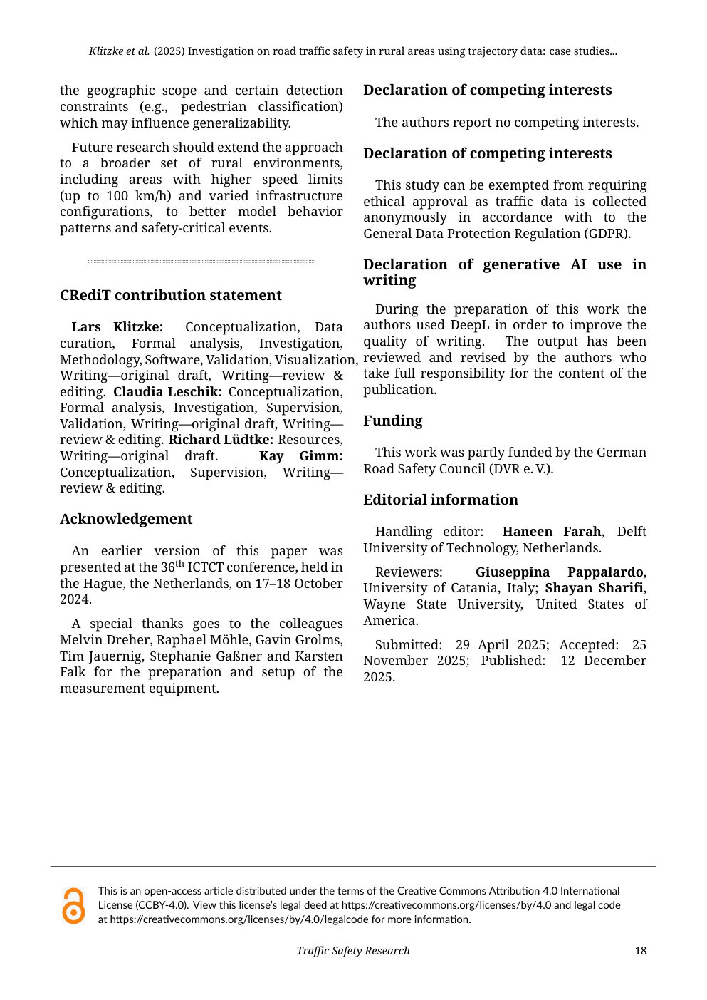

クリツケら。 (2025) 軌跡データを使用した農村部の道路交通安全に関する調査: ケーススタディ... 一般化可能性に影響を与える可能性がある地理的範囲と特定の検出制約 (歩行者の分類など)。今後の研究では、より高い速度制限（最大 100 km/h）やさまざまなインフラストラクチャ構成の地域を含む、より広範囲の農村環境にアプローチを拡張し、行動パターンや安全上重要なイベントをより適切にモデル化する必要があります。 ::::::::::::::::::::::::::::::::::::::::::::::::::::::::::::::::::::::: ::::::::::::::::::::::::::::::::::::::::::::::::::::::::::::::::::::::::: CRediT 寄稿文 Lars Klitzke: 概念化、データ キュレーション、形式分析、調査、方法論、ソフトウェア、検証、視覚化、執筆 - 原案、執筆 - レビューと編集。 Claudia Leschik: 概念化、形式分析、調査、監督、検証、執筆 - 原案、執筆 - レビューと編集。 Richard Lüdtke: リソース、執筆 - 原案。ケイ・ギム: 概念化、監督、執筆 - レビューと編集。謝辞 この論文の以前のバージョンは、2024 年 10 月 17 ～ 18 日にオランダのハーグで開催された第 36 回 ICTCT 会議で発表されました。測定機器の準備とセットアップに協力してくれた同僚の Melvin Dreher、Raphael Möhle、Gavin Grolms、Tim Jauernig、Stephanie Gaßner、Karsten Falk に特別な感謝を捧げます。競合する利益の宣言 著者らは競合する利益を報告していません。競合する利益の宣言 トラフィック データは一般データ保護規則 (GDPR) に従って匿名で収集されるため、この研究では倫理的承認の必要性が免除されます。執筆における生成 AI の使用宣言 この作品の準備中に、著者は執筆の品質を向上させるために DeepL を使用しました。出力は、出版物の内容に対して全責任を負う著者によってレビューおよび改訂されています。資金提供 この研究の一部はドイツ交通安全協会 (DVR e. V .) から資金提供を受けました。編集情報 担当編集者：Haneen Farah、デルフト工科大学、オランダ。査読者: Giuseppina Pappalardo 、カターニア大学、イタリア。シャヤン・シャリフィ、ウェイン州立大学、アメリカ合衆国。提出日: 2025 年 4 月 29 日。受理日: 2025 年 11 月 25 日。発行日: 2025 年 12 月 12 日。交通安全研究 18 これは、クリエイティブ コモンズ表示 4.0 国際ライセンス (CCBY-4.0) の条件に基づいて配布されるオープンアクセスの記事です。詳細については、https://creativecommons.org/licenses/by/4.0 でこのライセンスの法的行為を、https:/ /creativecommons.org/licenses/by/4.0/legalcode で法コードをご覧ください。

## ページ 19

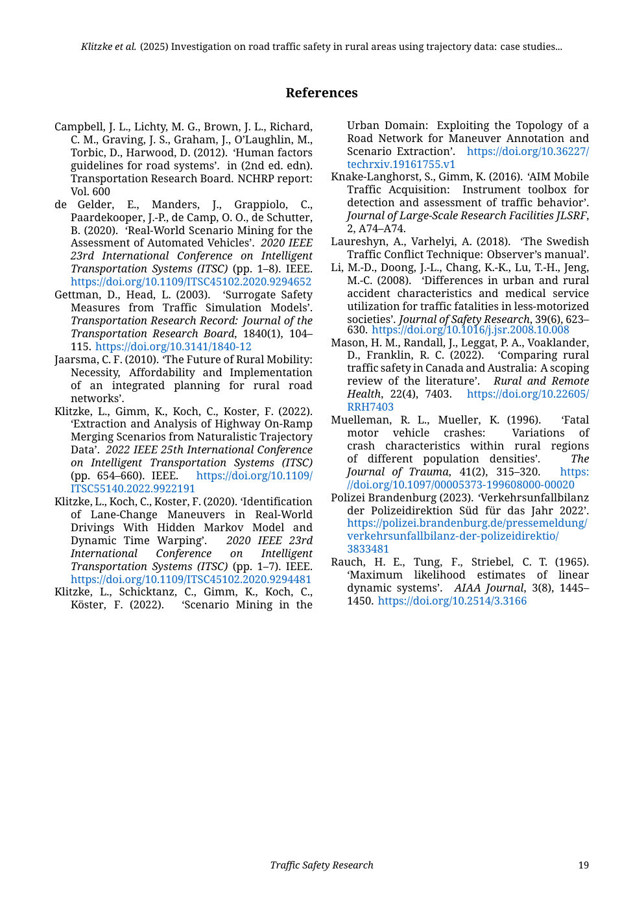

クリツケら。 (2025) 軌跡データを使用した農村部の交通安全に関する調査: ケーススタディ... 参考文献 Campbell, J. L.、Lichty, M. G.、Brown, J. L.、Richard, C. M.、Graving, J. S.、Graham, J.、O’Laughlin, M.、Torbic, D.、Harwood, D. (2012)。 「道路システムのための人的要因ガイドライン」。 （第2版）。運輸研究委員会。 NCHRPレポート：Vol. 600 de Gelder, E.、Manders, J.、Grappiolo, C.、Paardekooper, J.-P.、de Camp, O. O.、de Schutter, B. (2020)。 「自動運転車の評価のための現実世界のシナリオマイニング」。 2020 IEEE 23rd International Conference on Intelligent Transportation Systems (ITSC) (1 ～ 8 ページ)。 IEEE。 https://doi.org/10.1109/ITSC45102.2020.9294652 ゲットマン、D.、ヘッド、L. (2003)。 「交通シミュレーションモデルによる安全対策の代替」。交通研究記録: Journal of the Transportation Research Board、1840(1)、104–115。 https://doi.org/10.3141/1840-12 Jaarsma、C. F. (2010)。 「農村部のモビリティの将来: 農村部の道路ネットワークの統合計画の必要性、手頃な価格、および導入」。 Klitzke、L.、Gimm、K.、Koch、C.、Koster、F. (2022)。 「自然主義的な軌道データからの高速道路のランプ合流シナリオの抽出と分析」。 2022 IEEE 25th International Conference on Intelligent Transportation Systems (ITSC) (pp. 654–660)。 IEEE。 https://doi.org/10.1109/ ITSC55140.2022.9922191 Klitzke、L.、Koch、C.、Koster、F. (2020)。 「隠れマルコフ モデルと動的タイム ワーピングによる現実世界の運転における車線変更操作の特定」。 2020 IEEE 23rd International Conference on Intelligent Transportation Systems (ITSC) (1 ～ 7 ページ)。 IEEE。 https://doi.org/10.1109/ITSC45102.2020.9294481 Klitzke, L.、Schicktanz, C.、Gimm, K.、Koch, C.、Köster, F. (2022)。 「都市領域でのシナリオ マイニング: 操縦アノテーションとシナリオ抽出のための道路ネットワークのトポロジーの活用」。 https://doi.org/10.36227/techrxiv.19161755.v1 Knake-Langhorst、S.、Gimm、K. (2016)。 「AIM モバイル トラフィック取得: トラフィック動作の検出と評価のための機器ツールボックス」。大規模研究施設ジャーナル JLSRF、2、A74–A74。ローレシン、A.、ヴァルヘリイ、A. (2018)。 「スウェーデンの交通紛争テクニック: 観察者のマニュアル」。 Li, M.-D.、Doong, J.-L.、Chang, K.-K.、Lu, T.-H.、Jeng, M.-C. （2008年）。 「都市部と地方の事故の特徴の違いと、自動車の発達していない社会における交通死亡事故に対する医療サービスの利用状況」 Journal of Safety Research、39(6)、623–630。 https://doi.org/10.1016/j.jsr.2008.10.008 Mason, H.M.、Randall, J.、Leggat, P. A.、ヴォークランダー、D.、フランクリン、R.C. (2022)。 「カナダとオーストラリアの田舎の交通安全の比較: 文献の広範囲にわたるレビュー」。 Rural and Remote Health、22(4)、7403。 https://doi.org/10.22605/ RRH7403 Muelleman、R.L.、Mueller、K. (1996)。 「自動車死亡事故：人口密度が異なる農村地域における衝突特性の変化」。トラウマジャーナル、41(2)、315–320。 https://doi.org/10.1097/00005373-199608000-00020 ポリツェイ ブランデンブルク (2023)。 「Verkehrsunfallbilanz der Polizeidirektion Süd für das Jahr 2022」。 https://polizei.brandenburg.de/pressemeldung/ verkehrsunfallbilanz-der-polizeidirektio/ 3833481 Rauch, H.E.、Tung, F.、Striebel, C.T. (1965)。 「線形動的システムの最尤推定」。 AIAA ジャーナル、3(8)、1445 ～ 1450。 https://doi.org/10.2514/3.3166 交通安全研究 19
