# 日本語訳: Micro-level hotspot identification at intersections using traffic conflict analysis

- 原文ファイル: Micro-level hotspot identification at intersections using traffic conflict analysis.pdf
- ページ数: 14
- 作成日時: 2026-06-08 04:55:36
- 注記: PDFから抽出した本文の機械翻訳です。図表、数式、脚注、参考文献の体裁は元PDFと完全には一致しません。

## ページ 1

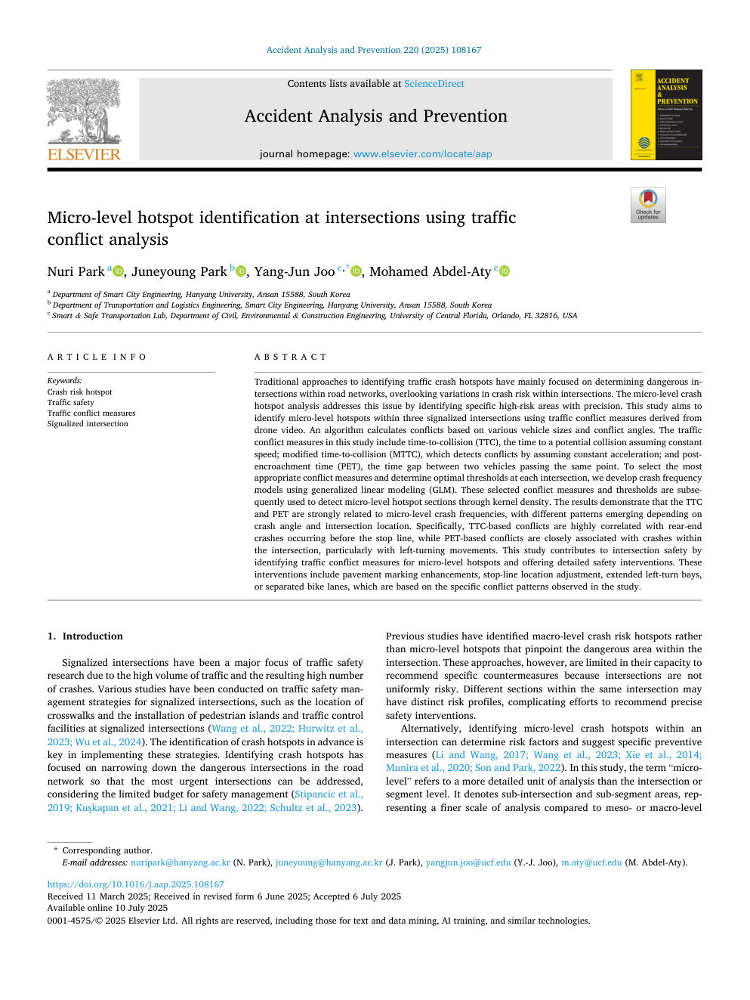

交通衝突分析を使用した交差点でのマイクロレベルのホットスポットの特定 ヌリ・パーク a 、ジュニョン・パーク b 、ヤン・ジュン・ジュ c 、* 、モハメド・アブデル・アティ c a スマートシティ工学部、漢陽大学、安山 15588、韓国 b 交通物流工学部、スマートシティ工学部、漢陽大学、安山 15588、韓国 c 土木・環境・建設学部、スマート＆安全交通研究室Engineering, University of Central Florida, Orlando, FL 32816, USA 記事情報 キーワード: 衝突リスク ホットスポット 交通安全 交通紛争対策 信号交差点 要旨 交通事故ホットスポットを特定する従来のアプローチは、主に道路網内の危険な交差点を特定することに焦点を当てており、交差点内の衝突リスクの変動は見落とされてきました。ミクロレベルのクラッシュ ホットスポット分析は、特定の高リスク領域を正確に特定することで、この問題に対処します。この研究は、ドローンのビデオから導き出された交通衝突対策を使用して、3 つの信号交差点内のミクロレベルのホットスポットを特定することを目的としています。アルゴリズムは、さまざまな車両のサイズと衝突角度に基づいて衝突を計算します。この研究における交通衝突の尺度には、衝突までの時間（TTC）、つまり一定の速度を仮定した場合に潜在的な衝突までの時間が含まれます。修正された衝突までの時間 (MTTC) は、一定の加速を想定して衝突を検出します。侵入後時間 (PET)、同じ地点を通過する 2 台の車両間の時間差。最も適切な衝突対策を選択し、各交差点での最適なしきい値を決定するために、一般化線形モデリング (GLM) を使用して衝突頻度モデルを開発します。これらの選択された競合の測定値としきい値は、その後、カーネル密度を通じてマイクロレベルのホットスポット セクションを検出するために使用されます。この結果は、TTC と PET がミクロレベルの衝突頻度に強く関係しており、衝突角度と交差点の位置に応じて異なるパターンが現れることを示しています。具体的には、TTC ベースの衝突は停止線手前で発生する追突事故と高い相関があるのに対し、PET ベースの衝突は交差点内、特に左折時の衝突と密接に関連しています。この研究は、ミクロレベルのホットスポットに対する交通衝突対策を特定し、詳細な安全介入を提供することにより、交差点の安全性に貢献します。これらの介入には、調査で観察された特定の衝突パターンに基づいた、舗装標示の強化、停止線の位置調整、左折区画の拡張、自転車レーンの分離などが含まれます。 1. はじめに 信号交差点は、交通量が多く、それに伴う事故件数も多いため、交通安全研究の主な焦点となってきました。横断歩道の位置、歩行者用島や信号交差点での交通規制施設の設置など、信号交差点の交通安全管理戦略についてさまざまな研究が行われてきた（Wang et al., 2022; Hurwitz et al., 2023; Wu et al., 2024）。これらの戦略を実装するには、クラッシュのホットスポットを事前に特定することが重要です。衝突ホットスポットの特定では、安全管理のための限られた予算を考慮して、最も緊急性の高い交差点に対処できるように、道路網内の危険な交差点を絞り込むことに重点が置かれています（Stipancic et al., 2019; Kus ¸ kapan et al., 2021; Li and Wang, 2022; Schultz et al., 2023）。これまでの研究では、交差点内の危険エリアを正確に特定するミクロレベルのホットスポットではなく、マクロレベルの衝突リスクのホットスポットが特定されていました。ただし、交差点は一様に危険なわけではないため、これらのアプローチでは、特定の対策を推奨する能力には限界があります。同じ交差点内の異なるセクションには異なるリスクプロファイルがある可能性があり、正確な安全介入を推奨する取り組みが複雑になります。あるいは、交差点内のミクロレベルの衝突ホットスポットを特定することで、危険因子を特定し、具体的な予防策を提案することもできます（Li and Wang, 2017; Wang et al., 2023; Xie et al., 2014; Munira et al., 2020; Son and Park, 2022）。この研究では、

「マイクロレベル」という用語は、交差レベルやセグメント レベルよりも詳細な分析単位を指します。これは、サブ交差点およびサブセグメント領域を示し、メソレベルまたはマクロレベルと比較してより細かいスケールの分析を表します * 対応著者。電子メールアドレス: nuripark@hanyang.ac.kr (N. Park)、juneyoung@hanyang.ac.kr (J. Park)、yangjun.joo@ucf.edu (Y.-J. Joo)、m.aty@ucf.edu (M. Abdel-Aty)。コンテンツ リストは、ScienceDirect Accident Analysis and Prevention ジャーナルのホームページで入手できます。 elsevier.com /locate/aap https://doi.org/10.1016/j.aap.2025.108167 2025 年 3 月 11 日に受信。 2025 年 6 月 6 日に改訂版を受領。 2025 年 7 月 6 日に受理 事故分析と予防 220 (2025) 108167 2025 年 7 月 10 日にオンラインで入手可能 0001-4575/© 2025 Elsevier Ltd. テキストおよびデータ マイニング、AI トレーニング、および同様のテクノロジーを含むすべての権利は留保されています。

## ページ 2

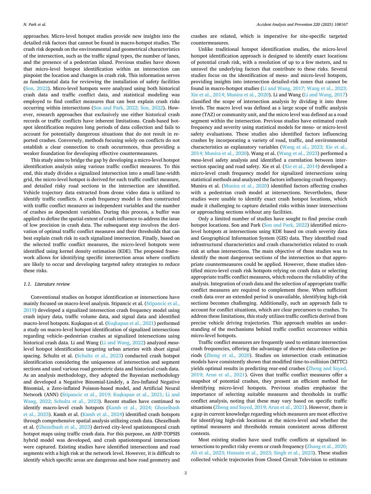

近づいてきます。ミクロレベルのホットスポット研究は、マクロホットスポット研究では見つけることができない詳細なリスク要因についての新たな洞察を提供します。衝突の危険性は、信号機の種類、車線数、歩行者専用島の有無など、交差点の環境的および幾何学的特性によって異なります。これまでの研究では、交差点内のミクロレベルのホットスポットを特定すると、位置と衝突リスクの変化を正確に特定できることが示されています。この情報は、安全設備の設置を検討するための基礎データとなります (Son, 2022)。過去の衝突データと交通衝突データの両方を使用してミクロレベルのホットスポットが分析され、交差点内で発生する衝突リスクを最もよく説明できる衝突対策を見つけるために統計モデリングが採用されました (Son and Park, 2022; Son, 2022)。しかし、過去の衝突記録または交通紛争のいずれかをもっぱら使用する研究アプローチには、固有の限界があります。クラッシュベースのホットスポットの特定には長期間のデータ収集が必要であり、報告されたクラッシュに至らない潜在的に危険な状況を考慮することができません。逆に、競合のみに焦点を当てた方法では、クラッシュの発生との明確な関係が確立されないため、効果的な対策を開発するための基盤が弱くなります。この研究は、さまざまなトラフィック競合対策を使用したミクロレベルのホットスポット識別分析を開発することでギャップを埋めることを目的としています。このため、本研究では信号交差点を小さな車線幅のグリッドに分割し、交通衝突対策ごとにミクロレベルのホットスポットを導出し、交差点内の詳細な危険道路区間を特定する。ドローンのビデオデータから抽出された車両軌跡データは、交通衝突の特定に利用されます。次に、独立変数として交通衝突の測定値、従属変数として衝突回数を使用して、衝突頻度モデルが構築されます。このプロセス中に、衝突データの低精度の問題に対処するために、衝突の影響の空間的範囲を定義するためにバッファが適用されました。次のステップでは、各信号交差点での衝突リスクを最もよく説明できる最適な交通衝突対策とそのしきい値を導き出します。最後に、選択されたトラフィック競合対策に基づいて、カーネル密度推定 (KDE) を使用してマイクロレベルのホットスポットが特定されました。提案された枠組みにより、衝突が発生する可能性が高い特定の交差点エリアを特定し、これらのリスクを軽減するための対象を絞った安全戦略を開発することが可能になります。 1.1.文献レビュー 交差点におけるホットスポットの特定に関する従来の研究は、主にマクロレベルの分析に焦点を当ててきました。スティパンチッチら。 (Stipancic et al.、2019) は、衝突傷害データ、交通量データ、信号データを使用して信号交差点の衝突頻度モデルを開発し、マクロレベルのホットスポットを特定しました。 Kus ¸ kapan et al. ( Kus ¸ kapan et al., 2021 ) は、過去の衝突データを使用して、信号交差点での車両と歩行者の衝突に関する信号交差点のマクロレベルのホットスポット特定に関する研究を実施しました。 Li と Wang (Li と Wang、2022) は、信号間隔の短い都市動脈をターゲットとしたメソレベルのホットスポットの特定を分析しました。シュルツら。 (Schultz et al., 2023) は、交差点とセグメントセクションの一意性を考慮して衝突ホットスポットの特定を実施し、さまざまな道路幾何学的データと過去の衝突データを使用しました。分析手法として、彼らはベイジアン手法を採用し、Negative Binomial-Lindely、Zeo-Inflated Negative Binomial、Zero-inflated Poisson-based モデル、および Artificial Neural Network (ANN) を開発しました (Stipancic et al., 2019; Kus ¸ kapan et al., 2021; Li and Wang, 2022;シュルツら、2023 年）。最近の研究では、マクロレベルのクラッシュホットスポットの特定が続けられている（Kamh et al., 2024; Ghezelbash et al., 2023）。カムら。 (Kamh et al., 2024) は、衝突データを利用した包括的な空間分析を通じて衝突ホットスポットを特定しました。ゲゼルバシュら。 ( Ghezelbash et al., 2023 ) は、交通事故データを使用して都市レベルの時空間衝突ホットスポット マップを導き出しました。この目的のために、AHP-TOPSIS ハイブリッド モデルが使用されます。

が開発され、衝突の時空間相互作用が捕捉されました。既存の研究では、ネットワーク レベルでリスクの高い交差点や道路セグメントが特定されています。しかし、どの特定のエリアが危険なのか、また道路の形状と衝突事故がどのように関係しているのかを特定することは困難であり、これはサイト固有の対象を絞った対策にとって不可欠です。従来のホットスポット特定研究とは異なり、ミクロレベルのホットスポット特定アプローチは、潜在的な衝突リスクの正確な位置を最大数メートルの解像度で特定し、これらのリスクに寄与する根本的な要因を解明するように設計されています。いくつかの研究はメソレベルおよびミクロレベルのホットスポットの特定に焦点を当てており、マクロホットスポット研究では見つけることができない交差点の詳細なリスクゾーンについての洞察を提供しています（Li and Wang、2017; Wang et al.、2023; Xie et al.、2014; Munira et al.、2020）。 Li and Wang ( Li and Wang, 2017 ) は、交差点分析の範囲を 3 つのレベルに分けて分類しました。マクロ レベルは交通分析ゾーン (TAZ) またはコミュニティ単位の広い範囲として定義され、ミクロ レベルは交差点内の道路セグメントとして定義されました。これまでの研究では、メゾレベルまたはミクロレベルの安全性評価のための統計モデルを使用して、衝突の頻度と重症度を推定していました。これらの研究では、さまざまな道路、交通、環境特性を説明変数として組み込むことで、衝突事故に影響を与える要因も特定されました（Wang et al., 2023; Xie et al., 2014; Munira et al., 2020）。王ら。 (Wang et al., 2023) は、メソレベルの安全性分析を実行し、セクション間の間隔と交通安全の間の相関関係を特定しました。謝ら。 (Xie et al., 2014) は、統計的手法を使用して信号交差点のミクロレベルの衝突頻度モデルを開発し、衝突頻度に影響を与える要因を分析しました。ムニラら。 ( Munira et al., 2020 ) は、交差点での歩行者衝突モデルを使用して、衝突に影響を与える要因を特定しました。それにも関わらず、これらの研究では正確な衝突ホットスポットの位置を特定することができず、施設のない交差点内側や接近セクション内の詳細なリスクを把握することが困難でした。衝突ホットスポットの正確な位置を見つけようとした研究は限られています。 Son と Park ( Son と Park、2022 ) は、衝突重大度データと地理情報システム (GIS) データに基づいて、KDE ​​を使用して交差点のミクロレベルのホットスポットを特定しました。彼らは、都市交差点での衝突リスクに関連する道路インフラの特性と衝突特性を特定しました。これらの研究の主な目的は、適切な対策を適用できるように、交差点の最も危険なセクションを特定することでした。しかし、これらの研究では、衝突データに依存したり、適切な交通衝突対策を選択したりするミクロレベルの衝突リスクのホットスポットが特定されており、これにより分析の信頼性が低下します。これらを補完するには、衝突データの統合と適切な交通衝突対策の選択が必要です。長期間にわたる十分な衝突データが入手できない場合、危険性の高いセクションを特定することが困難になります。さらに、このようなアプローチでは、クラッシュの明らかな前兆である競合状況を考慮できません。これらの制限に対処するために、この研究では、正確な車両の走行軌跡から得られる交通衝突を利用します。このアプローチにより、ミクロレベルのホットスポット内でトラフィック競合が発生する背後にあるメカニズムを理解することができます。交通衝突対策は、交差点の衝突頻度を推定するために頻繁に使用され、データ収集期間が短縮されるという利点があります (Zheng et al., 2020)。交差点衝突推定モデルに関する研究では、修正衝突時間 (MTTC) が追突事故の予測に最適な結果をもたらすことが一貫して示されています (Zheng and Sayed, 2019; Arun et al., 2021)。トラフィック競合対策が潜在的なクラッシュのスナップショットを提供することを考えると、マイクロレベルのホットスポットを特定するための効率的な方法となります。以前の研究では、交通衝突分析において適切な尺度としきい値を選択することの重要性が強調されており、これらの尺度やしきい値は次のような可能性があることに注意しています。

特定の交通状況に応じて変化します (Zheng and Sayed, 2019; Arun et al., 2021)。しかし、ミクロレベルで高リスクの場所を特定するにはどの対策が最も効果的であるか、最適な対策としきい値がさまざまな状況で一貫しているかどうかについて、現在の知識にはギャップがあります。既存の研究のほとんどは、信号交差点での交通衝突を利用して、危険な事象や衝突頻度を予測している（Zhang et al., 2020; Ali et al., 2023; Hussain et al., 2023; Singh et al., 2023）。これらの研究では、N. Park らの推定値を推定するために、Closed Circuit Television から車両の軌跡を収集しました。事故分析と予防 220 (2025) 108167 2

## ページ 3

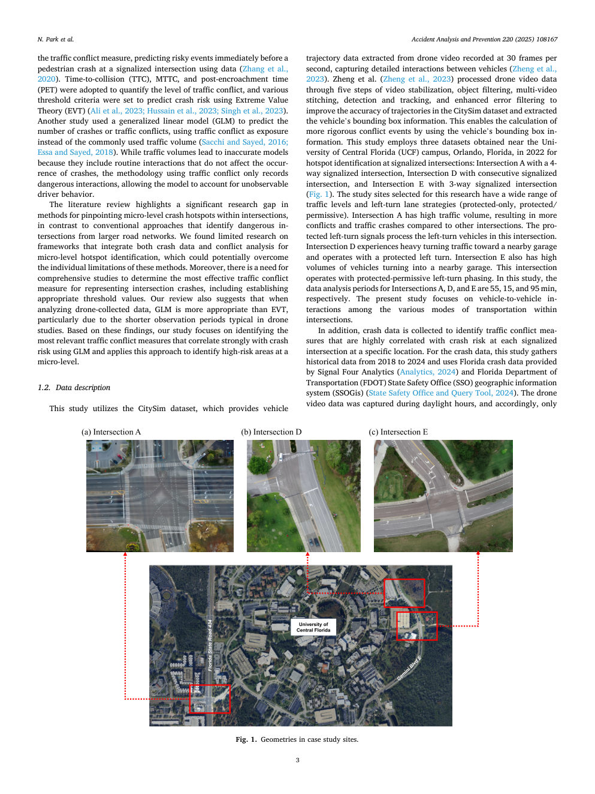

データを使用して信号交差点での歩行者衝突直前の危険な出来事を予測する交通紛争対策 (Zhang et al., 2020)。交通衝突のレベルを定量化するために、衝突までの時間（TTC）、MTTC、および侵入後時間（PET）が採用され、極値理論（EVT）を使用して衝突リスクを予測するためにさまざまなしきい値基準が設定されました（Ali et al., 2023; Hussain et al., 2023; Singh et al., 2023）。別の研究では、一般化線形モデル (GLM) を使用して、一般的に使用される交通量の代わりに交通衝突をエクスポージャとして使用して、衝突または交通衝突の数を予測しました (Sacchi and Sayed, 2016; Essa and Sayed, 2018)。交通量には衝突の発生に影響を及ぼさない日常的なやり取りが含まれるため、モデルが不正確になりますが、交通量の衝突を使用する手法では、危険なやり取りのみが記録されるため、観察できないドライバーの行動をモデルで考慮することができます。この文献レビューは、大規模な道路網から危険な交差点を特定する従来のアプローチとは対照的に、交差点内のミクロレベルの衝突ホットスポットを特定する方法における研究上の大きなギャップを浮き彫りにしている。私たちは、マイクロレベルのホットスポットを特定するためにクラッシュ データと競合分析の両方を統合するフレームワークに関する研究が限られていることがわかりました。これにより、これらの手法の個々の限界を克服できる可能性があります。さらに、適切なしきい値の設定を含め、交差点事故を表すための最も効果的な交通衝突の尺度を決定するための包括的な研究が必要です。私たちのレビューでは、ドローンで収集したデータを分析する場合、特にドローン研究では観測期間が短いため、EVT よりも GLM の方が適切であることも示唆しています。これらの調査結果に基づいて、私たちの研究は、GLM を使用して衝突リスクと強く相関する最も適切な交通衝突対策を特定することに焦点を当て、このアプローチをミクロレベルで高リスクエリアを特定するために適用します。 1.2.データの説明 この研究では、CitySim データセットを利用します。このデータセットは、毎秒 30 フレームで記録されたドローン ビデオから抽出された車両軌道データを提供し、車両間の詳細な相互作用をキャプチャします (Zheng et al., 2023)。鄭ら。 (Zheng et al., 2023) は、ビデオ安定化、オブジェクト フィルタリング、マルチビデオ スティッチング、検出と追跡、強化されたエラー フィルタリングの 5 つのステップを通じてドローン ビデオ データを処理し、CitySim データセット内の軌道の精度を向上させ、車両の境界ボックス情報を抽出しました。これにより、車両の境界ボックス情報を使用して、より厳密な衝突イベントの計算が可能になります。この研究では、信号交差点におけるホットスポットの特定のために、2022 年にフロリダ州オーランドのセントラルフロリダ大学 (UCF) キャンパス付近で取得された 3 つのデータセットが使用されています。すなわち、四車線信号交差点のある交差点 A、連続する信号交差点のある交差点 D、三叉路信号交差点のある交差点 E です (図 1)。この調査のために選択された調査地では、幅広い交通レベルと左折車線戦略 (保護のみ、保護/許可) が採用されています。交差点 A は交通量が多いため、他の交差点に比べて衝突や交通事故が多く発生します。保護された左折信号は、この交差点の左折車両を処理します。交差点 D は近くの車庫に向かう右折交通が多く、保護された左折で運行されます。交差点 E では、近くの車庫に入る車両が大量に発生します。この交差点は、保護と許可の左折段階で運行されています。この研究では、交差点 A、D、E のデータ分析期間はそれぞれ 55 分、15 分、95 分です。本研究は、交差点内のさまざまな交通手段間の車車間の相互作用に焦点を当てています。さらに、衝突データは、特定の場所の各信号交差点での衝突リスクと高度に相関する交通衝突対策を特定するために収集されます。衝突データについては、この研究では 2018 年から 2024 年までの過去のデータを収集し、Signal Four から提供されたフロリダの衝突データを使用しています。

Analytics ( Analytics、2024 ) およびフロリダ州運輸省 (FDOT) 州安全局 (SSO) 地理情報システム (SSOGis) (州安全局およびクエリ ツール、2024 )。ドローンのビデオ データは日中にキャプチャされたため、図 1. ケース スタディ サイトのジオメトリのみです。 N.パークら。事故分析と予防 220 (2025) 108167 3

## ページ 4

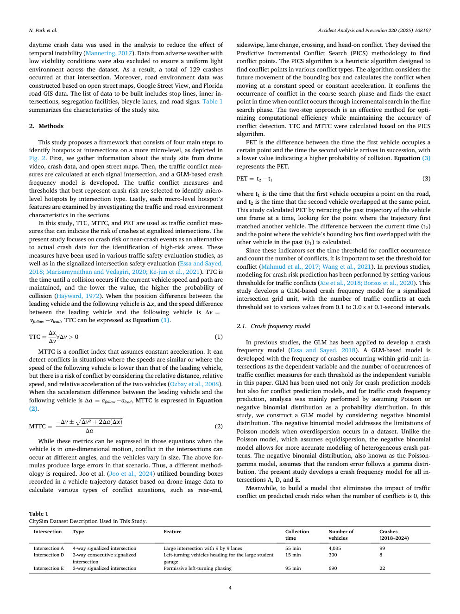

時間的不安定性の影響を軽減するために、日中の衝突データが分析に使用されました (Mannering、2017)。データセット全体で均一な光環境を確保するために、視界不良の悪天候によるデータも除外されました。その結果、その交差点では合計129件の衝突事故が発生した。また、道路環境データは、オープンストリートマップ、Googleストリートビュー、フロリダ道路GISデータに基づいて構築されました。構築するデータのリストには、停止線、内側交差点、分離施設、自転車レーン、道路標識が含まれます。表 1 は調査地の特徴をまとめたものです。 2. Methods This study proposes a framework that consists of four main steps to identify hotspots at intersections on a more micro-level, as depicted in Fig. 2 .まず、ドローンのビデオ、衝突データ、公開市街地図などから調査現場に関する情報を収集します。次に、各信号交差点での交通衝突対策が計算され、GLM ベースの衝突頻度モデルが開発されます。交差点の種類ごとにミクロレベルのホットスポットを特定するために、衝突リスクを最もよく表す交通衝突の測定値としきい値が選択されます。最後に、各セクションの交通および道路環境の特性を調査することで、各ミクロレベルのホットスポットの特徴を検討します。この研究では、信号交差点での衝突の危険性を示す交通衝突対策として、TTC、MTTC、および PET が使用されています。本研究は、高リスク領域を特定するための実際の衝突データの代替として、衝突リスクまたは衝突に近い事象に焦点を当てています。 These measures have been used in various traffic safety evaluation studies, as well as in the signalized intersection safety evaluation ( Essa and Sayed, 2018; Marisamynathan and Vedagiri, 2020; Ke-jun et al., 2021 ). TTC is the time until a collision occurs if the current vehicle speed and path are maintained, and the lower the value, the higher the probability of collision ( Hayward, 1972 ). When the position difference between the leading vehicle and the following vehicle is Δ x , and the speed difference between the leading vehicle and the following vehicle is Δ v = v follow v lead , TTC can be expressed as Equation (1) . TTC = Δ x Δ v ∀ Δ v > 0 (1) MTTC は一定の加速度を仮定した競合指数です。 It can detect conflicts in situations where the speeds are similar or where the speed of the following vehicle is lower than that of the leading vehicle, but there is a risk of conflict by considering the relative distance, relative speed, and relative acceleration of the two vehicles ( Ozbay et al., 2008 ). When the acceleration difference between the leading vehicle and the following vehicle is Δ a = a follow a lead , MTTC is expressed in Equation (2) . MTTC = Δ v ± ̅̅̅̅̅̅̅̅̅̅̅̅̅̅̅̅̅̅̅̅̅̅̅̅̅̅̅̅ ̅̅̅̅ ̅ Δ v 2 + 2 Δ a ( Δ x ) √ Δ a (2) While these metrics can be expressed in those equations when the車両は一次元的に運動しているため、交差点での衝突はさまざまな角度で発生する可能性があり、車両のサイズも異なります。上記の for - mulas は、そのシナリオで大きなエラーを生成します。したがって、別の方法論が必要になります。 Joo et al. ( Joo et al., 2024 ) utilized bounding boxes recorded in a vehicle trajectory dataset based on drone image data to calculate various types of conflict situations, such as rear-end, sideswipe, lane change, crossing, and head-on conflict.彼らは、競合ポイントを見つけるための予測増分競合検索 (PICS) 手法を考案しました。 PICS アルゴリズムは、さまざまなタイプの競合における競合ポイントを見つけるように設計されたヒューリスティック アルゴリズムです。 The algorithm considers the future movement of the bounding box and calculates the conflict when moving at a constant speed or constant acceleration. It confirms the occurrence of conflict in the coarse search phase and finds the exact point in time when conflict occurs through incremental search in the fine search phase. 2 段階のアプローチは、競合検出の精度を維持しながら計算効率を最適化する効果的な方法です。 TTC と MTTC は PICS アルゴリズムに基づいて計算されました。 PET は、最初の車両が車両を占有するまでの時間の差です。

ある地点と後続車両が連続して到着した時刻を表し、値が低いほど衝突の可能性が高いことを示します。 Equation (3) represents the PET. PET = t 2 t 1 (3) ここで、t 1 は最初の車両が道路上の点を占有する時間、t 2 は同じ点で 2 番目の車両が重なり合った時間です。この研究では、車両の過去の軌跡を一度に 1 フレームずつたどり、軌跡が最初に別の車両と一致した点を探すことによって PET を計算しました。現在時刻 (t 2 ) と、過去に車両のバウンディング ボックスが他の車両と最初に重なった点 (t 1 ) との差が計算されます。これらの指標は競合発生の時間しきい値を設定し、競合の数をカウントするため、競合のしきい値を設定することが重要です (Mahmud et al., 2017; Wang et al., 2021)。これまでの研究では、交通衝突に対するさまざまなしきい値を設定することで、衝突リスク予測のモデリングが行われてきました（Xie et al., 2018; Borsos et al., 2020）。この研究では、信号交差点グリッド ユニットの GLM ベースの衝突頻度モデルを開発します。各しきい値での交通衝突の数は、0.1 秒間隔で 0.1 ～ 3.0 秒のさまざまな値に設定されます。 2.1.衝突頻度モデル 以前の研究では、GLM は衝突頻度モデルの開発に適用されてきました (Essa and Sayed、2018)。この論文では、グリッド単位の交差点内で発生する衝突の頻度を従属変数として、しきい値ごとの交通衝突対策の発生数を独立変数として、GLM ベースのモデルを開発します。 GLMは衝突予測モデルだけでなく衝突予測モデルにも利用されており、交通事故発生頻度予測では主にポアソン分布や負の二項分布を確率分布として仮定して解析が行われていました。本研究では負の二項分布を考慮してGLMモデルを構築する。負の二項モデルは、データセット内で過分散が発生した場合のポアソン モデルの制限に対処します。等分散を仮定するポアソン モデルとは異なり、負の二項モデルを使用すると、不均一な衝突パターンをより正確にモデリングできます。ポアソンガンマ モデルとしても知られる負の二項分布は、ランダム誤差がガンマ分布に従うと仮定しています。本研究では、すべての交差点 A、D、E の衝突頻度モデルを開発します。一方、衝突の数が 0 の場合に、予測される衝突リスクに対する交通衝突の影響を排除するモデルを構築するために、この研究で使用されるこの表 1 CitySim データセットの説明を使用します。交差点の種類 特徴 収集時間 事故発生台数（2018年～2024年） A交差点 信号交差点 9×9車線の大型交差点 55分 4,035 99 交差点D 三方連続信号交差点 大学生車庫方面左折車 15分 300 8 交差点E 三方信号交差点 左折容認 95台 min 690 22 N. Park et al.事故分析と予防 220 (2025) 108167 4

## ページ 5

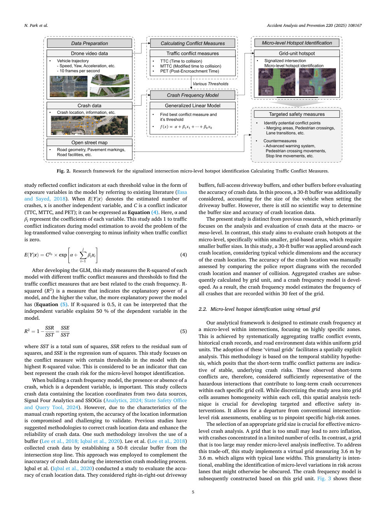

この研究は、既存の文献を参照することにより、モデル内のエクスポージャー変数の形式で各閾値における競合指標を反映しました (Essa and Sayed、2018)。 E ( Y | x ) が衝突の推定数を表す場合、x は別の独立変数、C は競合指標 (TTC、MTTC、および PET) です。それは式(4)のように表すことができます。ここで、α、β i は各変数の係数を表す。この調査では、トラフィック競合がゼロの場合に対数変換された値がマイナス無限大に収束する問題を回避するために、モデル推定中にトラフィック競合指標に 1 を追加します。 E ( Y | x ) = C β 0 × exp [ α + ∑ j i = 1 β i x i ] (4) GLM を開発した後、この研究では、衝突頻度に最もよく関連する交通衝突測定値を見つけるために、さまざまな交通衝突測定値としきい値を使用して各モデルの R 二乗を測定します。 R2乗(R2)はモデルの説明力を示す尺度であり、値が大きいほどモデルの説明力が高くなります(式(5)。R2乗が0.5の場合、独立変数がモデル内の従属変数の50%を説明すると解釈できます。 R2 = 1 SSR SST = SSE SST (5) ここで、SSTは平方和の総和、SSRは次の残差和を指します。この研究では、R 二乗値が最も高いモデル内の特定のしきい値による衝突測定に焦点を当てています。これは、衝突頻度モデルを構築する際に、従属変数である衝突の有無が重要です。この研究では、Signal Four Analytics と SSOGis の 2 つのデータ ソースから位置座標を含む衝突データを収集します。 Analytics, 2024; State Safety Office and Query Tool, 2024 ) ただし、手動衝突報告システムの特性により、位置情報の精度が損なわれ、検証が困難であることが、そのような方法論の 1 つとして提案されています (Lee et al., 2018; Iqbal et al., 2020)。 Iqbal et al. (2018) は、交差点の停止線から 50 フィートの円形バッファーを確立することで衝突データを収集しました。Iqbal et al. (2020) は、右から右への車道バッファーの精度を評価するために使用されました。このプロセスでは、私道バッファを設定する際に車両のサイズを考慮して、30 フィートのバッファも考慮されました。ただし、本研究は、主にマクロレベルまたはメソレベルでの衝突データの分析と評価に焦点を当てている以前の研究とは異なります。この研究では、一般的な車両の寸法と衝突位置の精度を考慮して、各衝突位置の周囲に 30 フィートのバッファを適用しました。衝突位置の精度は、記録された衝突位置および衝突方法と比較することによって手動で評価され、その後、衝突頻度モデルが作成され、すべての衝突の頻度が推定されます。 2.2. 仮想グリッドを使用したミクロレベルのホットスポットの特定 当社の分析フレームワークは、交通衝突イベント、過去の衝突記録、道路環境データを均一なグリッド単位で体系的に集約することで、交差点内の衝突頻度を推定するように設計されています。

空間的に明示的な分析が容易になります。この方法論は、一時的な安定性仮説に基づいており、短期的な交通衝突パターンは、安定した潜在的な衝突リスクを示していると仮定します。したがって、これらの観察された短期衝突は、各特定のグリッド セル内で長期衝突が発生する原因となる危険な相互作用を十分に表していると考えられます。研究領域をグリッドセルに離散化することは各セル内の均一性を前提としていますが、この空間解析技術は的を絞った効果的な安全介入を開発するために不可欠です。これにより、従来の交差点レベルのリスク評価から脱却でき、特定の高リスクゾーンを正確に特定できるようになります。効果的なミクロレベルの衝突解析には、適切なグリッド サイズの選択が重要です。グリッドが小さすぎると、限られた数のセルにクラッシュが集中してインフレがゼロになる可能性があります。対照的に、グリッドが大きすぎると、ミクロレベルの分析が無効になる可能性があります。このトレードオフに対処するために、この研究では 3.6 m × 3.6 m の仮想グリッドを実装します。これは一般的な車線幅と一致しています。この粒度は意図的なものであり、そうでなければ不明瞭になる可能性のあるレーン間のリスクのミクロレベルの変動を特定できるようになります。その後、このグリッド単位に基づいて衝突頻度モデルが構築されます。図 3 にこれらを示します。 N.パークら。事故分析と予防 220 (2025) 108167 5

## ページ 6

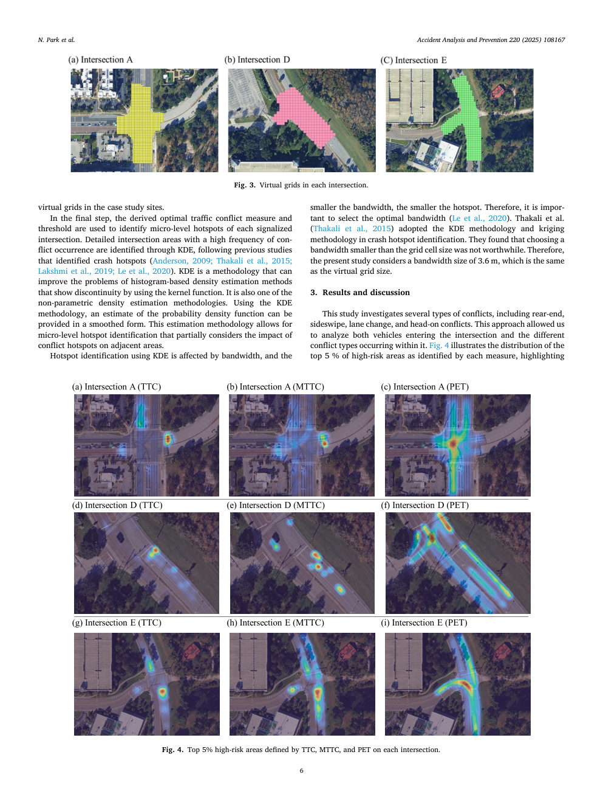

ケーススタディサイトの仮想グリッド。最後のステップでは、導出された最適な交通競合指標としきい値を使用して、各信号交差点のミクロレベルのホットスポットを特定します。衝突ホットスポットを特定した以前の研究 (Anderson, 2009; Thakali et al., 2015; Lakshmi et al., 2019; Le et al., 2020) に続いて、衝突が発生する頻度が高い詳細な交差点エリアが KDE によって特定されます。 KDE は、カーネル関数を使用して不連続性を示すヒストグラムベースの密度推定方法の問題を改善できる方法論です。ノンパラメトリック密度推定手法のひとつでもあります。 KDE 手法を使用すると、確率密度関数の推定値を平滑化された形式で提供できます。この推定方法により、隣接エリアへの競合ホットスポットの影響を部分的に考慮したミクロレベルのホットスポットの特定が可能になります。 KDE を使用したホットスポットの識別は帯域幅の影響を受け、帯域幅が小さいほどホットスポットも小さくなります。したがって、最適な帯域幅を選択することが重要です (Le et al., 2020)。タカリら。 (Thakali et al.、2015) は、クラッシュ ホットスポットの特定に KDE 手法とクリギング手法を採用しました。彼らは、グリッド セル サイズより小さい帯域幅を選択することは価値がないことを発見しました。したがって、本研究では、仮想グリッド サイズと同じ 3.6 m の帯域幅サイズを考慮します。 3. 結果と考察 この研究では、追突、横滑り、車線変更、正面衝突など、いくつかのタイプの衝突を調査しました。このアプローチにより、交差点に進入する車両と交差点内で発生するさまざまな種類の衝突の両方を分析することができました。図 4 は、各測定値によって特定された高リスク地域の上位 5 % の分布を示し、図 3. 各交差点の仮想グリッドを強調表示しています。図 4. 各交差点の TTC、MTTC、PET によって定義された上位 5% の高リスクエリア。 N.パークら。事故分析と予防 220 (2025) 108167 6

## ページ 7

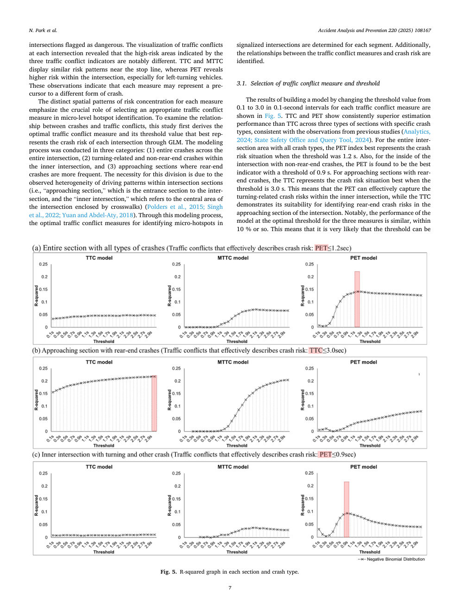

危険信号が立てられた交差点。各交差点での交通衝突を視覚化したところ、3 つの交通衝突指標が示す高リスクエリアが著しく異なることが明らかになりました。 TTC と MTTC は停止線付近で同様のリスク パターンを示しますが、PET では交差点内、特に左折車両のリスクが高いことがわかります。これらの観察は、各測定値が異なる形態のクラッシュの前兆である可能性があることを示しています。各測定値のリスク集中の明確な空間パターンは、ミクロレベルのホットスポットの特定において適切なトラフィック競合測定値を選択するという重要な役割を強調します。衝突と交通衝突の関係を調べるために、この研究ではまず、GLM を通じて各交差点の衝突リスクを最もよく表す最適な交通衝突尺度とそのしきい値を導き出します。モデリング プロセスは、(1) 交差点全体にわたる衝突全体、(2) 交差点内側の方向転換関連および非追突事故、(3) 追突事故がより頻繁に発生する接近セクションの 3 つのカテゴリに分けて実行されました。この分割の必要性は、交差点セクション（つまり、交差点への入口セクションである「進入セクション」と、横断歩道で囲まれた交差点の中央エリアを指す「内側交差点」）内で観察された運転パターンの不均一性によるものです（Polders et al., 2015; Singh et al., 2022; Yuan and Abdel-Aty, 2018）。このモデリング プロセスを通じて、信号交差点のマイクロ ホットスポットを特定するための最適な交通競合対策がセグメントごとに決定されます。さらに、交通紛争対策と衝突リスクとの関係も特定されます。 3.1.トラフィック競合対策と閾値の選択 トラフィック競合対策ごとに閾値を0.1から3.0まで0.1秒間隔で変化させてモデルを構築した結果を図5に示します。 TTC と PET は、特定の衝突タイプの 3 種類のセクションにわたって、一貫して TTC よりも優れた推定パフォーマンスを示しており、これは以前の研究の観察結果と一致しています (Analytics, 2024; State Safety Office and Query Tool, 2024)。すべての衝突タイプの交差領域全体について、しきい値が 1.2 秒の場合、PET 指数は衝突リスクの状況を最もよく表します。また、追突事故以外の交差点内側については、しきい値が 0.9 秒の PET が最良の指標であることがわかります。追突事故が発生する接近セクションの場合、TTC はしきい値が 3.0 秒の場合に衝突リスク状況を最もよく表します。これは、PET が交差点内側の方向転換に関連した衝突リスクを効果的に把握できる一方、TTC が交差点進入区間での追突リスクの特定に適していることを示しています。特に、3 つの測定値の最適なしきい値でのモデルのパフォーマンスはほぼ 10% 以内で類似しています。これは、しきい値が次のセクションと衝突タイプになる可能性が非常に高いことを意味します。 N.パークら。事故分析と予防 220 (2025) 108167 7

## ページ 8

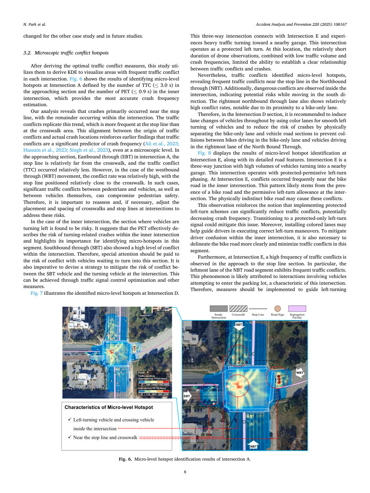

他のケーススタディおよび今後の研究では変更されます。 3.2.微視的な交通衝突ホットスポット 本研究では、最適な交通衝突対策を導出した後、それを利用してKDEを導出し、各交差点における交通衝突が多発しているエリアを可視化する。図6は、交差点Aにおけるミクロレベルのホットスポットを特定した結果を示しており、進入セクションのTTC数（≤3.0秒）と内側交差点のPET数（≤0.9秒）によって定義され、最も正確な衝突頻度推定が得られます。私たちの分析により、衝突事故は主に停止線付近で発生し、残りは交差点内で発生していることが明らかになりました。交通衝突もこの傾向を再現しており、横断歩道付近よりも停止線で頻繁に発生しています。交通衝突の原因と実際の衝突場所とのこの一致は、たとえ顕微鏡レベルであっても、交通衝突が衝突頻度の重要な予測因子であるという以前の発見を補強するものである(Ali et al., 2023; Hussain et al., 2023; Singh et al., 2023)。交差点 A の進入区間である Eastbound through (EBT) では、停止線が横断歩道から比較的離れており、交通衝突 (TTC) の発生は比較的少なかった。しかし、西行き通過（WBT）の場合は、停止線が横断歩道に比較的近い位置にあったため、衝突率が比較的高かった。このような場合、歩行者と車両の間、および車両同士の間で重大な交通衝突が発生し、歩行者の安全が損なわれる可能性があります。したがって、これらのリスクに対処するために、交差点の横断歩道や停止線の配置や間隔を再評価し、必要に応じて調整することが重要です。内側の交差点の場合、車両が左折する区間が危険であることがわかります。これは、PET が交差点内側での方向転換に関連した衝突のリスクを効果的に記述し、このセグメントのマイクロ ホットスポットを特定する上での重要性を強調していることを示唆しています。南行き通過（SBT）でも、交差点内での高レベルの衝突が見られました。したがって、このセクションに入るのを待っている車両との衝突の危険に特別な注意を払う必要があります。また、交差点での SBT 車両と右折車両の間の衝突のリスクを軽減する戦略を考案することも不可欠です。これは、交通信号制御の最適化などの手段によって実現できます。図 7 は、交差点 D で特定されたマイクロレベルのホットスポットを示しています。この三叉路交差点は交差点 E と接続しており、近くの車庫に向かう交通量が多いです。この交差点は保護された左折として機能します。この場所では、ドローンによる観測時間が比較的短く、交通量と衝突頻度が低いため、交通衝突と衝突との明確な関係を確立する能力が制限されていました。それにもかかわらず、交通衝突によりミクロレベルのホットスポットが特定され、ノースバウンドスルー（NBT）の停止線付近で交通衝突が頻繁に発生していることが明らかになりました。さらに、交差点内で危険な衝突が観察され、南方向に移動する際の潜在的な危険性を示しています。一番右の北行きの通過車線も比較的高い衝突率を示しており、自転車専用車線に近いために顕著です。このため、D交差点区間では、車両のスムーズな左折を可能にするカラーレーンを活用し、全体で車両の車線変更を誘導するとともに、自転車専用レーンを走行する自転車と北行き右端の車線を走行する車両との衝突を防止するため、自転車専用レーンと車両道路区間を物理的に分離することで衝突リスクを低減することが推奨される。図 8 は、交差点 E におけるミクロレベルのホットスポット特定の結果と、その詳細な道路特徴を示しています。交差点 E は三叉路で、近くの車庫に入る車両が大量にあります。この交差点は、保護と許可の左折段階で運行されています。交差点Eでは、交差点内側の自転車道路付近で衝突が多発。このパターンはおそらく自転車専用道路の存在と、

交差点での左折許可は許容されます。物理的に区別できない自転車道路は、これらの衝突を引き起こす可能性があります。この観察は、保護された左折スキームを実装すると交通衝突を大幅に減らし、衝突頻度を潜在的に減らすことができるという考えを強化します。保護専用の左折信号に移行すると、この問題が軽減される可能性があります。さらに、色付きの車線を設置すると、ドライバーが正しい左折操作を実行できるようガイドするのに役立つ可能性があります。内側の交差点内でのドライバーの混乱を軽減するには、自転車道路の輪郭をより明確にし、この区間での交通の衝突を最小限に抑えることも必要です。また、交差点 E では、停止線区間への進入時に衝突事故が多発しています。特に、NBT 道路区間の左端の車線では交通渋滞が頻繁に発生しています。この現象は、この交差点の特徴である駐車場に進入しようとする車両の衝突によるものと考えられます。したがって、左折を誘導するための措置を講じる必要がある。事故分析と予防 220 (2025) 108167 8

## ページ 9

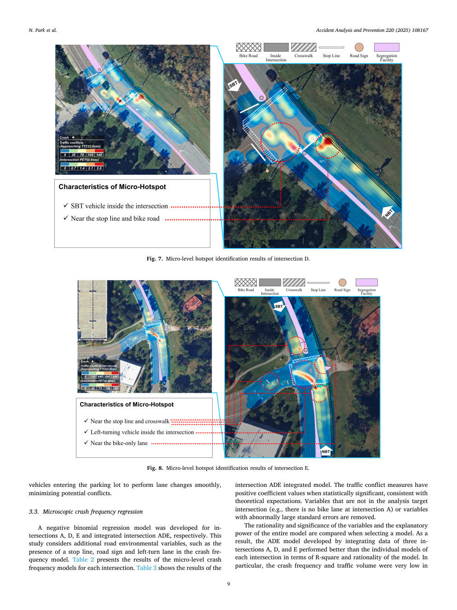

駐車場に進入する車両がスムーズに車線変更を行い、潜在的な衝突を最小限に抑えます。 3.3.微視的衝突頻度回帰 負の二項回帰モデルが、交差点 A、D、E および統合交差点 ADE に対してそれぞれ開発されました。この研究では、衝突頻度モデルにおける停止線、道路標識、左折車線の存在など、追加の道路環境変数を考慮しています。表 2 は、各交差点のミクロレベルの衝突頻度モデルの結果を示しています。表 3 に交差 ADE 統合モデルの結果を示します。トラフィック競合の測定値は、統計的に有意であり、理論的な期待と一致する場合、正の係数値を持ちます。解析対象交差点に存在しない変数（例：交差点Aには自転車レーンがない）や、標準誤差が異常に大きい変数は削除されます。モデルを選択する際には、変数の合理性や重要性、モデル全体の説明力を比較します。その結果、3 つの交差点 A、D、E のデータを統合して開発した ADE モデルは、R 二乗とモデルの合理性の点で、各交差点の個別モデルよりも優れたパフォーマンスを示しました。特に、図 7. 交差点 D のミクロレベルのホットスポット識別結果。 図 8. 交差点のミクロレベルのホットスポット識別結果 E. N. Park et al.事故分析と予防 220 (2025) 108167 9

## ページ 10

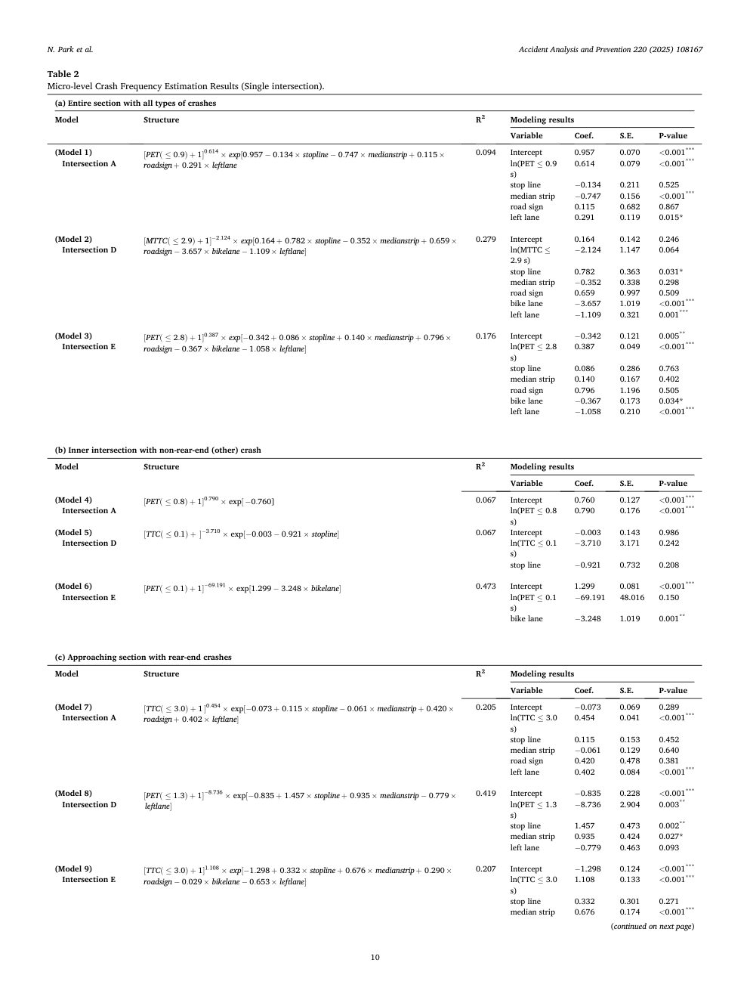

表 2 ミクロレベルの衝突頻度の推定結果 (単一交差点)。 (a) あらゆるタイプのクラッシュを含むセクション全体 モデル構造 R 2 モデリング結果 変数 Coef。 S.E. P 値 (モデル 1) 交点 A [ PET ( ≤ 0 . 9 ) + 1 ] 0 。 614 × 経験 [0 . 957 0 。 134 × ストップライン 0 。 747 × 中央値 + 0 。 115 × 道路標識 + 0 。 291 × 左車線 0.094 インターセプト 0.957 0.070 < 0.001 *** ln(PET ≤ 0.9 s) 0.614 0.079 < 0.001 *** 停止線 0.134 0.211 0.525 中央分離帯 0.747 0.156 < 0.001 *** 道路標識0.115 0.682 0.867 左車線 0.291 0.119 0.015* (モデル 2) 交差点 D [MTTC (≤ 2 . 9 ) + 1 ] 2 . 124 × 経験 [0 . 164 + 0 。 782 × ストップライン 0 。 352 × 中央値 + 0 。 659 × 道路標識 3 。 657 × バイクレーン 1 。 109 × 左車線 ] 0.279 インターセプト 0.164 0.142 0.246 ln(MTTC ≤ 2.9 秒) 2.124 1.147 0.064 停止線 0.782 0.363 0.031* 中央分離帯 0.352 0.338 0.298 道路標識0.659 0.997 0.509 自転車レーン 3.657 1.019 < 0.001 *** 左車線 1.109 0.321 0.001 *** (モデル 3) 交差点 E [PET (≤ 2 . 8 ) + 1 ] 0 . 387 × 経験 [0 . 342 + 0 。 086 × 停止線 + 0 。 140 × 中央値 + 0 。 796 × 道路標識 0 。 367 × バイクレーン 1 。 058 × 左車線 ] 0.176 インターセプト 0.342 0.121 0.005 ** ln(PET ≤ 2.8 s) 0.387 0.049 < 0.001 *** 停止線 0.086 0.286 0.763 中央分離帯 0.140 0.167 0.402 道路標識0.796 1.196 0.505 自転車レーン 0.367 0.173 0.034* 左車線 1.058 0.210 < 0.001 *** (b) 非追突（その他）衝突の内側交差点 モデル構造 R 2 モデル化結果 変数 Coef. S.E. P 値 (モデル 4) 交点 A [ PET ( ≤ 0 . 8 ) + 1 ] 0 。 790 × 経験 [0 . 760] 0.067 切片 0.760 0.127 < 0.001 *** ln(PET ≤ 0.8 s) 0.790 0.176 < 0.001 *** (モデル 5) 交点 D [ TTC ( ≤ 0 . 1 ) + ] 3 。 710 × exp [0 . 003 0 . 921 × ストップライン ] 0.067 切片 0.003 0.143 0.986 ln(TTC ≤ 0.1 s) 3.710 3.171 0.242 ストップライン 0.921 0.732 0.208 (モデル 6) 交差点 E [ PET ( ≤ 0 . 1 ) + 1 ］ 69． 191 × 経験 [1 . 299 ３． 248 × バイクレーン ] 0.473 インターセプト 1.299 0.081 < 0.001 *** ln(PET ≤ 0.1 s) 69.191 48.016 0.150 バイクレーン 3.248 1.019 0.001 ** (c) 追突事故が発生した接近セクション モデル構造 R 2 モデリング結果変数係数。 S.E. P 値 (モデル 7) 交差 A [TTC (≤ 3 . 0 ) + 1 ] 0 . 454 × 経験 [0 . 073 + 0 。 115 × ストップライン 0 。 061 × 中央値 + 0 。 420 × 道路標識 + 0 。 402 × 左車線 ] 0.205 インターセプト 0.073 0.069 0.289 ln(TTC ≤ 3.0 s) 0.454 0.041 < 0.001 *** 停止線 0.115 0.153 0.452 中央分離帯 0.061 0.129 0.640 道路標識0.420 0.478 0.381 左車線 0.402 0.084 < 0.001 *** (モデル 8) 交差点 D [ PET ( ≤ 1 . 3 ) + 1 ] 8 . 736 × 経験 [0 . 835 + 1 。 457 × 停止線 + 0 。 935 × 中央値 0 。 779 × 左車線 ] 0.419 切片 0.835 0.228 < 0.001 *** ln(PET ≤ 1.3 s) 8.736 2.904 0.003 ** 停止線 1.457 0.473 0.002 ** 中央分離帯 0.935 0.424 0.027* 左レーン 0.779 0.463 0.093 (モデル 9) 交差点 E [TTC (≤ 3 . 0 ) + 1 ] 1 . 108 × 経験 [1 . 298 + 0 。 332 × 停止線 + 0 。 676 × 中央値 + 0 。 290 × 道路標識 0 。 029 × バイクレーン 0 。 653 × 左車線 ] 0.207 切片 1.298 0.124 < 0.001 *** ln(TTC ≤ 3.0 s) 1.108 0.133 < 0.001 *** 停止線 0.332 0.301 0.271 中央分離帯 0.676 0.174 < 0.001 *** (次のページに続く) N. Park et al.事故分析と予防 220 (2025) 108167 10

## ページ 11

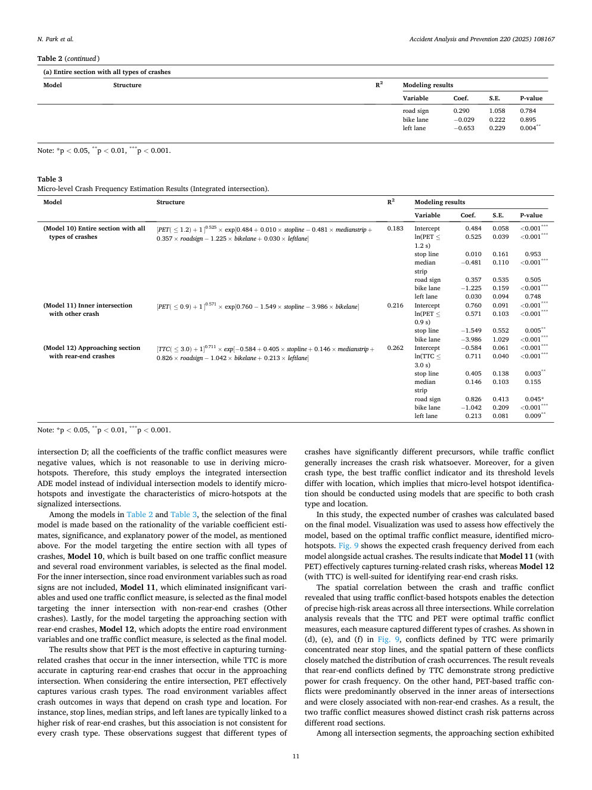

交差点D。トラフィック競合測定の係数はすべて負の値であり、マイクロホットスポットの導出に使用するのは合理的ではありません。したがって、この研究では、信号交差点におけるマイクロホットスポットを特定し、マイクロホットスポットの特性を調査するために、個別の交差点モデルの代わりに統合交差点ADEモデルを採用しています。表 2 と表 3 のモデルのうち、最終的なモデルの選択は、前述したように、変動係数推定値の合理性、重要性、モデルの説明力に基づいて行われます。あらゆるタイプの衝突が発生するセクション全体を対象としたモデルの場合、1 つの交通衝突対策といくつかの道路環境変数に基づいて構築されたモデル 10 が最終モデルとして選択されます。交差点内側については，道路標識などの道路環境変数が含まれていないため，非追突事故（その他の衝突）が発生した交差点内側を対象として，重要でない変数を除去し交通衝突対策を1つ使用したモデル11を最終モデルとして選択した。最後に、追突接近区間を対象としたモデルとして、道路環境変数全体と交通衝突対策を1つ採用したモデル12を最終モデルとして選択した。結果は、PET は内側の交差点で発生する旋回関連の衝突を捕捉するのに最も効果的であるのに対し、TTC は接近する交差点で発生する追突事故を捕捉するのにより正確であることを示しています。交差点全体を考慮すると、PET はさまざまな衝突タイプを効果的に捕捉します。道路環境変数は、衝突の種類と場所に応じて衝突の結果に影響を与えます。たとえば、停止線、中央分離帯、左車線は通常、追突事故のリスクが高いことと関連していますが、この関連性はすべての衝突タイプで一貫しているわけではありません。これらの観察は、交通衝突は一般的に衝突の危険性を増大させる一方、衝突の種類によっては大きく異なる前兆を持っていることを示唆しています。さらに、特定の衝突タイプに対して、最適なトラフィック競合指標とそのしきい値レベルは場所によって異なります。これは、ミクロレベルのホットスポットの特定は、衝突タイプと場所の両方に固有のモデルを使用して実行する必要があることを意味します。この研究では、最終モデルに基づいて予想される衝突回数が計算されました。視覚化を使用して、最適なトラフィック競合測定に基づいたモデルがマイクロホットスポットをどの程度効果的に特定したかを評価しました。図 9 は、各モデルから導出された予想衝突頻度と実際の衝突頻度を示しています。結果は、モデル 11 (PET 搭載) は旋回関連の衝突リスクを効果的に捉えているのに対し、モデル 12 (TTC 搭載) は追突リスクの特定に適していることを示しています。衝突事故と交通衝突との空間的相関関係から、交通衝突ベースのホットスポットを使用すると、3 つの交差点すべてにわたって高リスクエリアを正確に検出できることが明らかになりました。相関分析により、TTC と PET が最適な交通衝突対策であることが明らかになりましたが、それぞれの対策は異なるタイプの衝突を捉えていました。図９の（ｄ）、（ｅ）、（ｆ）に示すように、ＴＴＣによって定義された衝突は主に停止線付近に集中しており、これらの衝突の空間パターンは衝突発生の分布とよく一致していた。その結果、TTC が定義する追突衝突は、衝突頻度に対して強力な予測力を発揮することが明らかになりました。一方、PET ベースの交通衝突は主に交差点の内側で観察され、非追突事故と密接に関連していた。その結果、2 つの交通衝突対策では、さまざまな道路セクションにわたって明確な衝突リスク パターンが示されました。すべての交差点セグメントのうち、進入セクションでは表 2 (続き) (a) あらゆる種類の衝突が発生したセクション全体 モデル構造 R 2 モデリング結果 変数 Coef. S.E. P 値 道路標識 0.290 1.058 0.784 自転車レーン 0.029 0.222 0.895 左車線 0.653 0.229 0.004 ** 注: *p < 0.05、** p < 0.01、*** p < 0.001。表 3 ミクロレベルの衝突頻度の推定結果 (統合交差点)。モデル構造 R 2

モデリング結果の変数 Coef. S.E. P 値 (モデル 10) あらゆるタイプの衝突を含むセクション全体 [ PET ( ≤ 1 . 2 ) + 1 ] 0 。 525 × 経験 [0 . 484 + 0 。 010 × 停止線 0 。 481 × 中央値 + 0 。 357 × 道路標識 1 。 225 × バイクレーン + 0 。 030 × 左車線 ] 0.183 切片 0.484 0.058 < 0.001 *** ln(PET ≤ 1.2 s) 0.525 0.039 < 0.001 *** 停止線 0.010 0.161 0.953 中央分離帯 0.481 0.110 < 0.001 ***道路標識 0.357 0.535 0.505 自転車レーン 1.225 0.159 < 0.001 *** 左車線 0.030 0.094 0.748 (モデル 11) 他の衝突との内側交差点 [ PET ( ≤ 0 . 9 ) + 1 ] 0 . 571 × 経験 [0 . 760 1． 549 × ストップライン 3 。 986 × 自転車レーン ] 0.216 インターセプト 0.760 0.091 < 0.001 *** ln(PET ≤ 0.9 s) 0.571 0.103 < 0.001 *** 停止線 1.549 0.552 0.005 ** 自転車レーン 3.986 1.029 < 0.001 *** (モデル 12) 追突を伴う進入区間 [ TTC (≤ 3 . 0 ) + 1 ] 0 . 711 × 経験 [0 . 584 + 0 。 405 × 停止線 + 0 。 146 × 中央値 + 0 。 826 × 道路標識 1 。 042 × バイクレーン + 0 。 213 × 左車線 ] 0.262 インターセプト 0.584 0.061 < 0.001 *** ln(TTC ≤ 3.0 s) 0.711 0.040 < 0.001 *** 停止線 0.405 0.138 0.003 ** 中央分離帯 0.146 0.103 0.155符号 0.826 0.413 0.045* 自転車レーン 1.042 0.209 < 0.001 *** 左車線 0.213 0.081 0.009 ** 注: *p < 0.05、** p < 0.01、*** p < 0.001。 N.パークら。事故分析と予防 220 (2025) 108167 11

## ページ 12

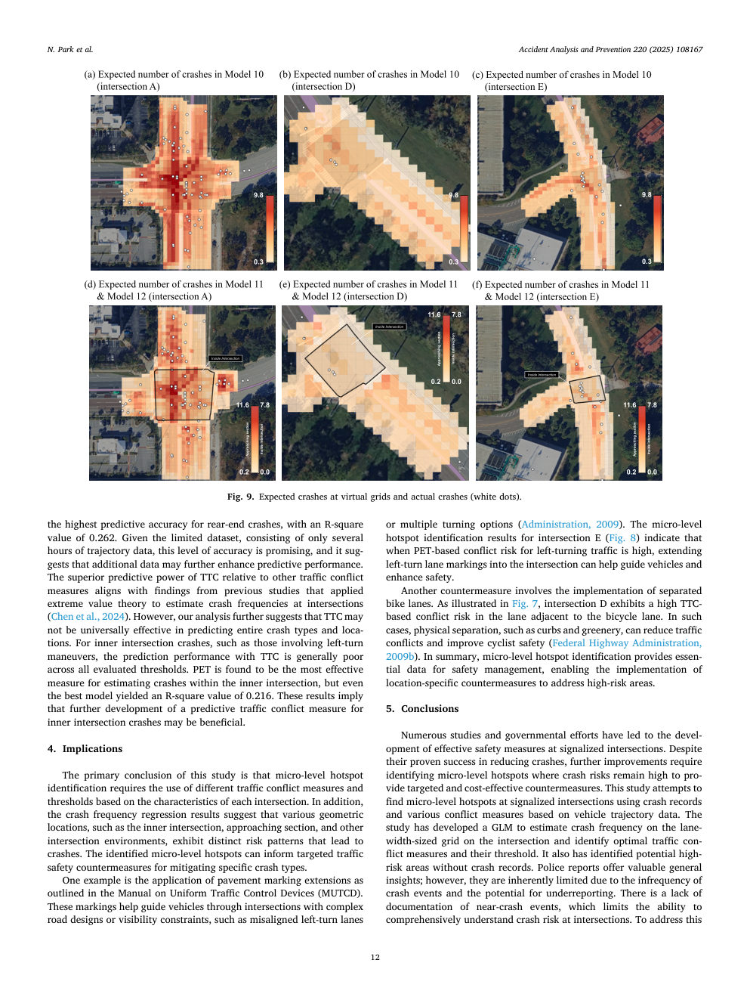

R 2 乗値は 0.262 で、追突事故の予測精度が最も高くなります。わずか数時間の軌跡データで構成される限られたデータセットを考慮すると、このレベルの精度は有望であり、データを追加することで予測パフォーマンスがさらに向上する可能性があることを示唆しています。他の交通衝突対策と比較した TTC の優れた予測力は、交差点での衝突頻度を推定するために極値理論を適用した以前の研究の結果と一致しています (Chen et al., 2024)。しかし、私たちの分析はさらに、TTC が衝突の種類と場所全体を予測するのに普遍的に有効ではない可能性があることを示唆しています。左折操作を伴う衝突など、交差点内側の衝突の場合、TTC による予測パフォーマンスは、評価されたすべてのしきい値にわたって一般に劣ります。 PET は内側の交差点内の衝突事故を推定するのに最も効果的な尺度であることがわかっていますが、最良のモデルでも R 二乗値は 0.216 でした。これらの結果は、交差点内側の衝突に対する予測交通衝突対策をさらに開発することが有益である可能性があることを示唆しています。 4. 示唆 この研究の主な結論は、ミクロレベルのホットスポットを特定するには、各交差点の特性に基づいて、さまざまな交通衝突対策としきい値を使用する必要があるということです。さらに、衝突頻度回帰の結果は、交差点内側、進入セクション、その他の交差点環境などのさまざまな幾何学的位置が、衝突につながる明確なリスク パターンを示していることを示唆しています。特定されたマイクロレベルのホットスポットは、特定のタイプの衝突を軽減するための対象となる交通安全対策を知らせることができます。一例は、統一交通制御装置マニュアル (MUTCD) に概要が記載されている舗装標示拡張の適用です。これらのマーキングは、左折車線の位置がずれていたり、複数の方向転換オプションがあるなど、複雑な道路設計や見通しの制約がある交差点を車両が通過できるようにするのに役立ちます (Administration, 2009)。交差点Eのミクロレベルのホットスポット特定結果（ 図8 ）は、左折交通に対するPETベースの衝突リスクが高い場合、左折車線区分線を交差点まで延長することで車両の誘導に役立ち、安全性を向上できることを示しています。もう一つの対策としては、分離自転車レーンの導入が挙げられます。図７に示すように、交差点Ｄは、自転車レーンに隣接する車線において、ＴＴＣに基づく衝突リスクが高い。このような場合、縁石や緑地などの物理的な分離によって交通衝突が減り、自転車利用者の安全性が向上する可能性があります (連邦道路管理局、2009b)。要約すると、ミクロレベルのホットスポットの特定は安全管理に不可欠なデータを提供し、高リスクエリアに対処するための場所固有の対策を実行できるようにします。 5. 結論 数多くの研究と政府の取り組みにより、信号交差点における効果的な安全対策の開発が行われてきました。クラッシュの削減には成功していることが証明されていますが、さらなる改善には、ターゲットを絞った費用対効果の高い対策を提供するために、クラッシュのリスクが依然として高いミクロレベルのホットスポットを特定する必要があります。この研究では、車両の軌跡データに基づく衝突記録とさまざまな衝突対策を使用して、信号交差点でのミクロレベルのホットスポットを発見することを試みています。この研究では、交差点の車線幅サイズのグリッドでの衝突頻度を推定し、最適な交通衝突対策とそのしきい値を特定するための GLM を開発しました。また、衝突記録がない潜在的な高リスク地域も特定しました。警察の報告書は貴重な一般的な洞察を提供します。ただし、クラッシュイベントの頻度が低く、過小報告される可能性があるため、本質的に制限されています。衝突寸前の出来事に関する文書が不足しているため、交差点での衝突リスクを包括的に理解する能力が制限されています。これに対処するために、図 9. 仮想グリッドで予想されるクラッシュと実際のクラッシュ (白い点)。 N.パークら。事故分析と予防 220 (2025) 108167 12

## ページ 13

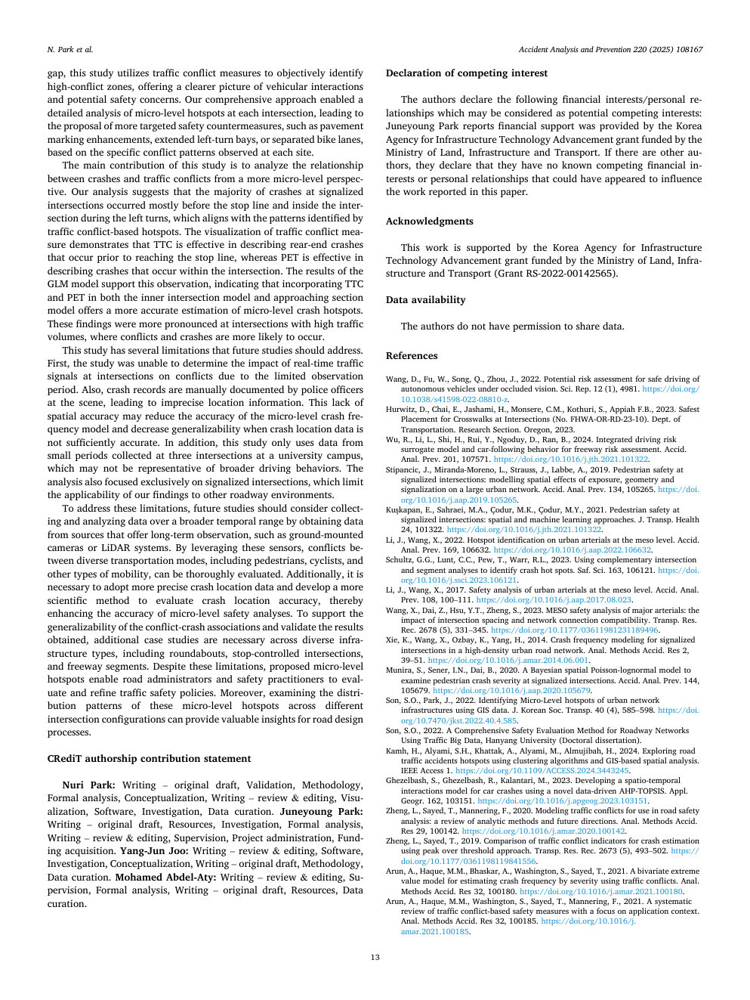

このギャップを考慮して、この研究では交通紛争対策を利用して高紛争地域を客観的に特定し、車両の相互作用と潜在的な安全上の懸念についてより明確な全体像を提供します。当社の包括的なアプローチにより、各交差点のミクロレベルのホットスポットの詳細な分析が可能になり、各現場で観察された特定の衝突パターンに基づいて、舗装標識の強化、左折区画の拡張、自転車レーンの分離など、より的を絞った安全対策の提案につながりました。この研究の主な貢献は、衝突事故と交通衝突の関係をよりミクロレベルの観点から分析したことです。私たちの分析によると、信号交差点での衝突事故の大部分は、主に停止線の手前と左折時の交差点内側で発生しており、これは交通衝突ベースのホットスポットによって特定されたパターンと一致しています。交通衝突対策の視覚化は、TTC が停止線に到達する前に発生する追突事故を説明するのに効果的であるのに対し、PET は交差点内で発生する衝突を説明するのに効果的であることを示しています。 GLM モデルの結果はこの観察を裏付けており、内側交差点モデルと進入セクション モデルの両方に TTC と PET を組み込むことで、ミクロレベルの衝突ホットスポットのより正確な推定が提供されることを示しています。これらの結果は、衝突や衝突が発生しやすい交通量の多い交差点でより顕著でした。この研究には、将来の研究で解決する必要があるいくつかの制限があります。まず、この研究では、観察期間が限られていたため、交差点のリアルタイム信号機が紛争に与える影響を判断できませんでした。また、衝突記録は現場の警察官によって手作業で記録されるため、位置情報が不正確になる可能性があります。この空間精度の欠如により、衝突位置データが十分に正確でない場合、ミクロレベルの衝突頻度モデルの精度が低下し、一般化可能性が低下する可能性があります。さらに、この研究では大学キャンパス内の 3 つの交差点で収集された短期間のデータのみを使用しているため、より広範な運転行動を表していない可能性があります。また、分析は信号交差点のみに焦点を当てていたため、調査結果の他の道路環境への適用は制限されていました。これらの限界に対処するために、将来の研究では、地上設置カメラやLiDARシステムなどの長期観測を提供するソースからデータを取得することにより、より広い時間範囲にわたるデータの収集と分析を検討する必要があります。これらのセンサーを活用することで、歩行者、自転車、その他のモビリティを含む多様な交通手段間の競合を徹底的に評価できます。さらに、より正確な衝突位置データを採用し、衝突位置の精度を評価するためのより科学的な方法を開発し、それによってミクロレベルの安全分析の精度を高める必要があります。紛争と衝突の関連性の一般化可能性を裏付け、得られた結果を検証するには、ラウンドアバウト交差点、一時停止規制のある交差点、高速道路区間など、さまざまな種類のインフラストラクチャにわたって追加のケーススタディが必要です。これらの制限にもかかわらず、提案されているマイクロレベルのホットスポットにより、道路管理者や安全担当者は交通安全政策を評価し、改善することができます。さらに、さまざまな交差点構成にわたるこれらのミクロレベルのホットスポットの分布パターンを調査することにより、道路設計プロセスに貴重な洞察が得られます。 CRediT 著者寄稿文 ヌリ・パーク: 執筆 - 原案、検証、方法論、形式分析、概念化、執筆 - レビューと編集、視覚化、ソフトウェア、調査、データキュレーション。 Juneyoung Park: 執筆 - 原案、リソース、調査、正式な分析、執筆 - レビューと編集、監督、プロジェクト管理、資金調達。 Yang-Jun Joo: 執筆 - レビューと編集、ソフトウェア、調査、概念化、執筆 - 原案、方法論、データキュレーション。 Mohamed Abdel-Aty: 執筆 – レビューと編集、監修、形式的分析、執筆 – オリジナル

ドラフト、リソース、データのキュレーション。競合利益の宣言 著者らは、潜在的な競合利益とみなされる可能性のある以下の経済的利益/人的関係を宣言します: Juneyoung Park は、国土交通省が資金提供する韓国インフラ技術推進庁の補助金によって資金援助が提供されたと報告しています。他に著者がいる場合、彼らは、この論文で報告されている研究に影響を与えた可能性がある既知の競合する経済的利害関係や個人的関係を持っていないことを宣言します。謝辞 この研究は、国土インフラ交通省が資金提供する韓国インフラ技術推進庁助成金 (助成金 RS-2022-00142565) によって支援されています。データの利用可能性 著者にはデータを共有する権限がありません。参考文献 Wang, D.、Fu, W.、Song, Q.、Zhou, J.、2022 年。視界が遮られた状態での自動運転車の安全運転のための潜在的なリスク評価。科学。議員 12 (1)、4981。https://doi.org/10.1038/s41598-022-08810-z。 Hurwitz, D.、Chai, E.、Jashami, H.、Monsere, C.M.、Kothuri, S.、Appiah F.B.、2023 年。交差点における横断歩道の最も安全な配置 (No. FHWA-OR-RD-23-10)。運輸省。研究セクション。オレゴン州、2023年。Wu、R.、Li、L.、Shi、H.、Rui、Y.、Ngoduy、D.、Ran、B.、2024年。高速道路リスク評価のための統合運転リスク代理モデルと車追従行動。酸性。アナル。前へ201、107571。https://doi.org/10.1016/j.jth.2021.101322。 Stipancic, J.、Miranda-Moreno, L.、Strauss, J.、Labbe, A.、2019 年。信号交差点における歩行者の安全: 大規模な都市ネットワークにおける露出、形状、信号化の空間的影響のモデル化。酸性。アナル。前へ134、105265。https://doi. org/10.1016/j.aap.2019.105265。 Kus ¸ kapan, E.、Sahraei, M.A.、Çodur, M.K.、Çodur, M.Y.、2021 年。信号交差点での歩行者の安全: 空間学習と機械学習のアプローチ。 J. Transp. Health 24、101322。https://doi.org/10.1016/j.jth.2021.101322。 Li, J.、Wang, X.、2022 年。メソ レベルでの都市動脈のホットスポットの特定。酸性。アナル。前へ169、106632。https://doi.org/10.1016/j.aap.2022.106632。 Schultz, G.G.、Lunt, C.C.、Pew, T.、Warr, R.L.、2023 年。相補的な交差分析とセグメント分析を使用して衝突ホットスポットを特定します。サフ。科学。 163、106121。 https://doi. org/10.1016/j.ssci.2023.106121。 Li, J.、Wang, X.、2017。メソレベルでの都市動脈の安全性分析。酸性。アナル。前へ108、100～111。 https://doi.org/10.1016/j.aap.2017.08.023。 Wang, X.、Dai, Z.、Hsu, Y.T.、Zheng, S.、2023 年。主要動脈の MESO 安全性分析: 交差点の間隔とネットワーク接続の互換性の影響。トランスペアレント解像度記録2678 (5)、331–345。 https://doi.org/10.1177/03611981231189496。 Xie, K.、Wang, X.、Ozbay, K.、Yang, H.、2014 年。高密度の都市道路ネットワークにおける信号交差点の衝突頻度モデリング。アナル。メソッド酸。解決策 2、39 ～ 51。 https://doi.org/10.1016/j.amar.2014.06.001。 Munira, S.、Sener, I.N.、Dai, B.、2020。信号交差点での歩行者衝突の重大度を調べるためのベイジアン空間ポアソン対数正規モデル。酸性。アナル。前へ144、105679。https://doi.org/10.1016/j.aap.2020.105679。 Son, S.O.、Park, J.、2022 年。GIS データを使用した都市ネットワーク インフラストラクチャのマイクロレベルのホットスポットの特定。 J.韓国協会トランスペアレント40 (4)、585–598。 https://doi. org/10.7470/jkst.2022.40.4.585。 Son, S.O.、2022. 交通ビッグデータを用いた道路網の総合安全評価手法、漢陽大学（博士論文）。 Kamh, H.、Alyami, S.H.、Khattak, A.、Alyami, M.、Almujibah, H.、2024 年。クラスタリング アルゴリズムと GIS ベースの空間分析を使用して、交通事故のホットスポットを調査。 IEEE アクセス 1. https://doi.org/10.1109/ACCESS.2024.3443245。 Ghezelbash, S.、Ghezelbash, R.、Kalantari, M.、2023 年。新しいデータ駆動型 AHP-TOPSIS を使用した自動車事故の時空間相互作用モデルの開発。応用地理。 162、103151。https://doi.org/10.1016/j.apgeog.2023.103151。 Zheng, L.、Sayed, T.、Mannering, F.、2020 年。交通安全分析で使用するための交通衝突のモデリング: 分析手法と将来の方向性のレビュー。アナル。メソッド酸。解像度29、

100142。 https://doi.org/10.1016/j.amar.2020.100142。 Zheng, L.、Sayed, T.、2019 年。ピークオーバーしきい値アプローチを使用した衝突推定のための交通衝突指標の比較。トランスペアレント解像度記録2673 (5)、493–502。 https://doi.org/10.1177/0361198119841556。 Arun, A.、Haque, M.M.、Bhaskar, A.、Washington, S.、Sayed, T.、2021。交通衝突を使用して重大度別に衝突頻度を推定するための二変量極値モデル。アナル。メソッド酸。レス 32、100180。https://doi.org/10.1016/j.amar.2021.100180。 Arun, A.、Haque, M.M.、ワシントン、S.、Sayed, T.、Mannering, F.、2021 年。アプリケーションのコンテキストに焦点を当てた、交通紛争に基づく安全対策の体系的なレビュー。アナル。メソッド酸。レス 32、100185。https://doi.org/10.1016/j。 amar.2021.100185。 N.パークら。事故分析と予防 220 (2025) 108167 13

## ページ 14

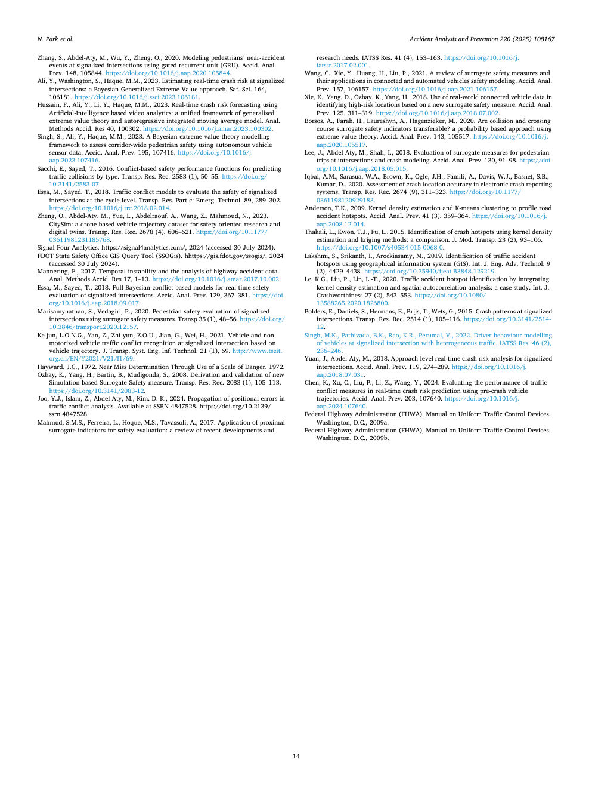

Zhang, S.、Abdel-Aty, M.、Wu, Y.、Zheng, O.、2020 年。ゲート リカレント ユニット (GRU) を使用した信号交差点での歩行者の事故に遭いそうになったイベントをモデル化。酸性。アナル。前へ148、105844。https://doi.org/10.1016/j.aap.2020.105844。 Ali, Y.、ワシントン、S.、Haque, M.M.、2023 年。信号交差点でのリアルタイムの衝突リスクの推定: ベイジアン一般化極値アプローチ。サフ。科学。 164、106181。https://doi.org/10.1016/j.ssci.2023.106181。 Hussain, F.、Ali, Y.、Li, Y.、Haque, M.M.、2023 年。人工知能ベースのビデオ分析を使用したリアルタイムの衝突リスク予測: 一般化された極値理論と自己回帰統合移動平均モデルの統一フレームワーク。アナル。メソッド酸。解像度 40、100302。https://doi.org/10.1016/j.amar.2023.100302。 Singh, S.、Ali, Y.、Haque, M.M.、2023 年。自動運転車のセンサー データを使用して通路全体の歩行者の安全性を評価するためのベイズ極値理論モデリング フレームワーク。酸性。アナル。前へ195、107416。https://doi.org/10.1016/j。 aap.2023.107416。 Sacchi, E.、Sayed, T.、2016 年。交通衝突をタイプ別に予測するための紛争ベースの安全パフォーマンス関数。トランスペアレント解像度記録2583 (1)、50–55。 https://doi.org/10.3141/2583-07。 Essa, M.、Sayed, T.、2018 年。自転車レベルで信号交差点の安全性を評価するための交通衝突モデル。トランスペアレント解像度パート c: 出現。テクノロジー。 89、289–302。 https://doi.org/10.1016/j.trc.2018.02.014。 Zheng, O.、Abdel-Aty, M.、Yue, L.、Abdelraouf, A.、Wang, Z.、Mahmoud, N.、2023 年。 CitySim: 安全指向の研究とデジタル ツインのためのドローン ベースの車両軌道データセット。トランスペアレント解像度記録2678 (4)、606–621。 https://doi.org/10.1177/ 03611981231185768. シグナル フォー アナリティクス。 https://signal4analytics.com/、2024 (2024 年 7 月 30 日にアクセス)。 FDOT 州安全局 GIS クエリ ツール (SSOGis)。 hhttps://gis.fdot.gov/ssogis/、2024 (2024 年 7 月 30 日にアクセス)。 Mannering, F.、2017。時間的不安定性と高速道路事故データの分析。アナル。メソッド酸。解像度 17、1 ～ 13。 https://doi.org/10.1016/j.amar.2017.10.002。 Essa, M.、Sayed, T.、2018 年。信号交差点のリアルタイム安全性評価のための完全ベイジアン衝突ベース モデル。酸性。アナル。前へ129、367–381。 https://doi. org/10.1016/j.aap.2018.09.017。 Marisamynathan, S.、Vedagiri, P.、2020。代替安全対策を使用した信号交差点の歩行者の安全評価。トランスプ 35 (1)、48–56。 https://doi.org/10.3846/transport.2020.12157。 Ke-jun、L.O.N.G.、Yan、Z.、Zhi-yun、Z.O.U.、Jian, G.、Wei, H.、2021。車両の軌跡に基づく信号交差点での車両と非電動車両の交通衝突認識。 J. Transp.システム。工学情報テクノロジー。 21 (1)、69。http://www.tseit. org.cn/EN/Y2021/V21/I1/69 。 J.C. ヘイワード、1972 年。危険の尺度を使用したニアミスの判定。 1972. Ozbay, K.、Yang, H.、Bartin, B.、Mudigonda, S.、2008. 新しいシミュレーションベースの代理安全対策の導出と検証。トランスペアレント解像度記録2083 (1)、105–113。 https://doi.org/10.3141/2083-12。ジュー、Y.J.、イスラム、Z.、アブデル・アティ、M.、キム。 D. K.、2024。交通衝突分析における位置誤差の伝播。 SSRN 4847528 で入手できます。https://doi.org/10.2139/ ssrn.4847528。 Mahmud, S.M.S.、Ferreira, L.、Hoque, M.S.、Tavassoli, A.、2017 年。安全性評価のための近位代替指標の適用: 最近の開発と研究ニーズのレビュー。 IATSS Res. 41 (4)、153–163。 https://doi.org/10.1016/j。 iatssr.2017.02.001。 Wang, C.、Xie, Y.、Huang, H.、Liu, P.、2021 年。コネクテッドおよび自動化車両の安全モデリングにおける代替安全対策とその応用のレビュー。酸性。アナル。前へ157、106157。https://doi.org/10.1016/j.aap.2021.106157。 Xie, K.、Yang, D.、Ozbay, K.、Yang, H.、2018 年。新しい代替安全対策に基づいて危険度の高い場所を特定する際の現実世界のコネクテッド ビークル データの使用。酸性。アナル。前へ125、311–319。 https://doi.org/10.1016/j.aap.2018.07.002。 Borsos, A.、Farah, H.、Laureshyn, A.、Hagenzieker, M.、2020. 衝突とコース横断の代替安全指標は譲渡可能ですか?極値理論を使用した確率ベースのアプローチ。酸性。アナル。前へ143、105517。https://doi.org/10.1016/j。 aap.2020.105517。リー、J.、

Abdel-Aty, M.、Shah, I.、2018 年。交差点での歩行者の移動に対する代替手段の評価と衝突モデリング。酸性。アナル。前へ130、91-98。 https://doi. org/10.1016/j.aap.2018.05.015。 Iqbal, A.M.、Sarasua, W.A.、Brown, K.、Ogle, J.H.、Famili, A.、Davis, W.J.、Basnet, S.B.、Kumar, D.、2020。電子衝突報告システムにおける衝突位置の精度の評価。トランスペアレント解像度記録2674 (9)、311–323。 https://doi.org/10.1177/ 0361198120929183. Anderson, T.K., 2009. 交通事故のホットスポットをプロファイリングするためのカーネル密度推定と K 平均法クラスタリング。酸性。アナル。前へ41 (3)、359–364。 https://doi.org/10.1016/j。 aap.2008.12.014。 Thakali, L.、Kwon, T.J.、Fu, L.、2015 年。カーネル密度推定とクリギング手法を使用したクラッシュ ホットスポットの特定: 比較。 Ｊ．Ｍｏｄ．トランスペアレント23 (2)、93–106。 https://doi.org/10.1007/s40534-015-0068-0。 Lakshmi, S.、Srikanth, I.、Arockiasamy, M.、2019 年。地理情報システム (GIS) を使用した交通事故多発地点の特定。内部。 J.Eng.上級テクノロジー。 9 (2)、4429–4438。 https://doi.org/10.35940/ijeat.B3848.129219。 Le, K.G.、Liu, P.、Lin, L.-T.、2020 年。カーネル密度推定と空間的自己相関分析の統合による交通事故ホットスポットの特定: ケーススタディ。内部。 J. Crashworthiness 27 (2)、543–553。 https://doi.org/10.1080/ 13588265.2020.1826800。 Polders, E.、Daniels, S.、Hermans, E.、Brijs, T.、Wets, G.、2015 年。信号交差点での衝突パターン。トランスペアレント解像度記録2514 (1)、105–116。 https://doi.org/10.3141/251412。 Singh, M.K.、Pathivada, B.K.、Rao, K.R.、Permal, V.、2022 年。異種交通が混在する信号交差点における車両のドライバー行動モデリング。 IATSS Res. 46 (2)、236–246 。 Yuan, J.、Abdel-Aty, M.、2018 年。信号交差点の進入レベルのリアルタイム衝突リスク分析。酸性。アナル。前へ119、274–289。 https://doi.org/10.1016/j。 aap.2018.07.031。 Chen, K.、Xu, C.、Liu, P.、Li, Z.、Wang, Y.、2024 年。衝突前の車両軌道を使用したリアルタイムの衝突リスク予測における交通衝突対策のパフォーマンスの評価。酸性。アナル。前へ203、107640。https://doi.org/10.1016/j。 aap.2024.107640。連邦道路局 (FHWA)、統一交通制御装置に関するマニュアル。ワシントン D.C.、2009a。連邦道路局 (FHWA)、統一交通制御装置に関するマニュアル。ワシントン D.C.、2009b。 N.パークら。事故分析と予防 220 (2025) 108167 14
